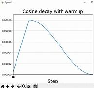

# GPT2 From Scratch (124M version)

## Table of Contents
1. [Introduction](#introduction)
2. [Training Data](#training-data)
3. [The GPT Architecture](#the-gpt-architecture)
    - [Input Embeddings](#input-embeddings)
    - [The Transformer Block](#the-transformer-block)
        - [Masked Multi-Head Self-Attention](#1-masked-multi-head-self-attention)
        - [Feed Forward Block](#2-feed-forward-block)
        - [residual Connections](#3-residual-connections)
        - [Layer Normalization](#4-layer-normalization)
    - [The Output Layer](#the-output-layer)
4. [Training details](#training-details)
    - [parameter sharing and weight tying](#parameter-sharing-and-weight-tying)
    - [Model Initialization](#model-initialization)
    - [Hyperparameters](#hyperparameters)
        - [Optimizer](#optimizer)
        - [gradient clipping](#gradient-clipping)
        - [learning rate scheduler: Warmup + Cosine Decay](#learning-rate-scheduler-warmup--cosine-decay)
        - [Gradual batch size increase](#gradual-batch-size-increase)
        - [Weight Decay](#weight-decay)
        - [Batch size with Gradient Accumulation](#batch-size-with-gradient-accumulation)
    - [Speeding up the training](#speeding-up-the-training)
        - [Tensor Float 32 (supported in Ampere series only)](#tensor-float-32-supported-in-ampere-series-only)
        - [Torch Compile](#torch-compile)
        - [Flash Attention](#flash-attention)
        - [Nice/Ugly numbers](#niceugly-numbers)
        - [Fused AdamW](#fused-adamw)
        - [Distributed Data Parallel (DDP) on multiple GPUs](#distributed-data-parallel-ddp-on-multiple-gpus)
        - [Training information](#training-information)


5. [Results](#results)
6. [Usage](#usage)
7. [Fine Tuning](#fine-tuning)
8. [Future Work](#future-work)
9. [Fun Prompts](#fun-prompts)
10. [References](#references)


## Introduction

This Project is an implementation of the GPT2 model from scratch using PyTorch (the 124M version). It is based on both OpenAI's ChatGPT-2 paper [Language Models are Unsupervised Multitask Learners](https://cdn.openai.com/better-language-models/language_models_are_unsupervised_multitask_learners.pdf) and ChatGPT-3 paper [Language Models are Few-Shot Learners](https://arxiv.org/pdf/2005.14165.pdf), and Andrej Karpathy's wonderful series [Neural Networks Zero to Hero](https://www.youtube.com/playlist?list=PLAqhIrjkxbuWI23v9cThsA9GvCAUhRvKZ)

The GPT model is a transformer-based language model that uses the self-attention mechanism to generate text. The model is trained on a large corpus of text data (called `base model`), and then it can be fine-tuned on a smaller and more specific dataset  to generate text in a specific domain like Chatbot Assistant (like the ChatGPT assistant).

OpenAI Released the GPT2 model in 2019. They released the paper [Language Models are Unsupervised Multitask Learners](https://cdn.openai.com/better-language-models/language_models_are_unsupervised_multitask_learners.pdf), This blog post [better Language models and their implications](https://openai.com/index/better-language-models/) and this code [GPT2](https://github.com/openai/gpt-2). In addition, they also released the weights for the model in 4 sizes: 124M, 355M, 774M, and 1558M.

We will implement and train the 124M version of the GPT2 model from scratch using PyTorch. and then we will compare the results with the original model from OpenAI.

## Training Data

- GPT2 used WebText dataset (which wasn't released) to train their model.
    - they scraped all outbound links from reddit with at least 3 Karma (outbund links are links that posted on reddit that lead to other websites).
    - There is an attempt at reproducing it called `OpenWebText` dataset

- As for GPT3, the paper mentions CommonCrawl, which is an extremely noisy and random subset of the internet
    - so people go into great lengths to filter common crawl data to make it more useful
    - So, they used data mixtures of filtered CommonCrawl, WebText2 (which is a cleaned version of WebText), books, and Wikipedia
    
    
    
    *data mixture used in training the GPT3 model*

    - the dataset for GPT3 also wasn't released


- However, there are quite good datasets that can be used today to train a language models
    - [RedPajama Dataset](https://huggingface.co/datasets/togethercomputer/RedPajama-Data-V2)
        - and more precisely, the [SlimPajama](https://huggingface.co/datasets/cerebras/SlimPajama-627B/blob/main/README.md) which is a cleaned and deduplicated version of the RedPajama dataset
    - [FineWeb](https://huggingface.co/spaces/HuggingFaceFW/blogpost-fineweb-v1) dataset, which is a recent attempt to collect really high-quality CommonCrawl data and filter it to 15 Trillion tokens, basically filtered commonCrawl to a very high educational subsets
        - in addition to it, hugging face released [FineWeb EDU](https://huggingface.co/datasets/HuggingFaceFW/fineweb-edu), which is a 1.3 Trillion tokens of very high educational content and 5.4 Trillion tokens of high educational content
        

- This repo uses a 10 Billion tokens sampled from the `FineWeb EDU` dataset

- Note that the number of tokens are measured with the gpt2 tokenizer, which takes us to the next point of discussion

- `Tokenization`: Tokenization is the process of converting stream of text into a stream of numbers (tokens). OpenAI uses an algorithm called `Byte Pair Encoding` (BPE) to tokenize the text. The GPT2 model uses a 50,257 tokens vocabulary, Which is the Vocabulary used in this repo. It is available in the `Tiktoken` Library by OpenAI. The library supports encoding and decoding text to and from tokens, but it doesn't support training the vocabulary from scratch. Check the Folder `GPT_Tokenizer` for more details on the Byte Pair Encoding algorithm and the training of the vocabulary from scratch on any given data.


## The GPT Architecture

The GPT model is shown in the following figure:


- it consists of several parts
    - the Input Embeddings
        - which consists of the token embeddings and the position embeddings
    - the Transformer block
        - Which consists of Masked Multi-Head Self-Attention, Feed Forward Block, Layer Normalization, and Residual Connections
    - the Output Layer
        - Which is a linear layer that maps the output of the transformer block to the logits of the vocabulary


### Input Embeddings

- The input embeddings are the sum of the `Token Embeddings` and the `Positional Embeddings`
    - `Token Embeddings`: are ways to assign a vector representation to each token in the vocabulary. The token embeddings are learned during training
    - `Positional Embeddings`: are ways to assign a vector representation to each position in the sequence. They will also be learned during training

- What are Embeddings in the first place?
    - As mentioned earlier, once the vocabulary is constructed, we can map the text into integers 
    - see a subset of the GPT2 vocabulary below
    
    - as seen in the image, each token "Piece of text" is mapped to an integer, and the GPT2 model, the vocabulary size is 50,257 (so we have 50,257 unique tokens)
    - We then map each integer to a vector `Embedding` using a lookup table, which is a matrix of size `Vocab_size x Embedding_size`
        - In GPT2, the embedding size is 768, which means that every token will be represented by a vector of size 768
    - These embeddings are learned during training, which means that we start with random values and update them during training to minimize the loss function
        - what actually will happen is that the transformer will re-arrange these vectors in the space so that similar tokens are close to each other (meaning similar tokens have similar embeddings)
        - that is simply due to the fact that similar words will have similar contexts, Therefore receiving similar gradients during training
    - So, The embeddings are helpful in that they help the model to learn the relationships between the tokens in the vocabulary (learns about the similarity and differences between the tokens)
    - see the following GIF for the tokenization and embedding process

    

- So, in `Token Embeddings`, we map each token to a vector of size 768, and in `Positional Embeddings`, we map each position in the sequence to a vector of size 768 as well, and then we sum them together to get the input embeddings

- Why do we need `Positional Embeddings`?
    - Unlike RNNs, LSTMs, and GRUs, which process the sequence in order, Transformers process the sequence in parallel. This means that the model doesn't know the order of the tokens in the sequence. Therefore, we assign a vector to each position in the sequence to help the model know the order of the tokens in the sequence and so, if we have 2 tokens appearing in different positions in the sequence, they will have slightly different embeddings
    - We said that transformers can process the entire sequence at once, but we can't feed the entire sequence of the whole text at once due to memory constraints, so we usually chunk the text into smaller parts called `blocks` and feed them one by one to the model
        - In GPT2, the block size is 1024 tokens (which means that we chunk the text into blocks of 1024 tokens each and feed them one by one to the model)
        - So, for each position in the 1024 tokens, we assign a vector of size 768 to it -using a lookup table of size 1024 x 768- and then we sum it with the token embeddings to get the input embeddings

- So, to recap the preprocessing steps:
    - Vocabulary Construction: we map each token "piece of text" to an integer
    - Tokenization: we convert the text into integers using the vocabulary constructed in the previous step
    - Chunking: we chunk the text into blocks of 1024 tokens each, Then create X and Y pairs, where X is some `block_size` tokens and Y is the same size but shifted by one token to the right (since we are trying to predict the next token in the sequence)
        - so for example, if the block size is 9, we will take some 10 tokens from the text (say 0, 1, 2, 3, 4, 5, 6, 7, 8, 9) and create X and Y pairs as follows:
            - X: 0, 1, 2, 3, 4, 5, 6, 7, 8
            - Y: 1, 2, 3, 4, 5, 6, 7, 8, 9
    - `Encoding`: we convert the integers (that represent the tokens) into token embeddings and figure out the position of each token in the sequence and convert it into positional embeddings, then sum them together to get the input embeddings


### The Transformer Block


The Transformer block consists of several parts:
- `Masked Multi-Head Self-Attention`
- `Feed Forward Block`
- `Layer Normalization`
- `Residual Connections`

#### 1. Masked Multi-Head Self-Attention

The attention mechanism is the core of the transformer model, and it is simply a way of communication between the tokens in the sequence using matrix multiplication. In other words, we allow each token to gather information from all other tokens in the sequence, and we do that in a parallel fashion using matrix multiplication with a weight matrix.

For example, if we have a sequence of 4 tokens, and each token is represented by an embedding of size 3, then we have the input embeddings as follows:

```math
\begin{bmatrix}
a1 & a2 & a3 \\
b1 & b2 & b3 \\
c1 & c2 & c3 \\
d1 & d2 & d3
\end{bmatrix}
```

- where the first row corresponds to the embeddings of the first token, the second row corresponds to the embeddings of the second token, and so on

If we have the following weight matrix $W$:

```math
\begin{bmatrix}
1 & 0 & 0 & 0 \\
1 & 1 & 0 & 0 \\
1 & 1 & 1 & 0 \\
1 & 1 & 1 & 1
\end{bmatrix}
```

This will simply allow each token to sum the embeddings of previous tokens using $W * X$ 

```math
\begin{bmatrix}
a1             & a2             & a3            \\
a1+b1          & a2+b2          & a3+b3         \\
a1+b1+c1       & a2+b2+c2       & a3+b3+c3      \\
a1+b1+c1+d1    & a2+b2+c2+d2    & a3+b3+c3+d3
\end{bmatrix}
```

So the first row -which corresponds to the first token- will remain the same, the second row will be the sum of the first and second token embeddings, the third row will be the sum of the first, second, and third token embeddings, and so on.

But instead, if we have the following weight matrix:

```math
\begin{bmatrix}
1    & 0    & 0    & 0    \\
0.5  & 0.5  & 0    & 0    \\
0.33 & 0.33 & 0.33 & 0    \\
0.25 & 0.25 & 0.25 & 0.25
\end{bmatrix}
```

Using also matrix multiplication $W * X$, this will allow each token to be the average of itself along with the previous tokens:

```math
\begin{bmatrix}
a1                   & a2                   & a3                  \\
0.5(a1+b1)           & 0.5(a2+b2)           & 0.5(a3+b3)          \\
0.33(a1+b1+c1)       & 0.33(a2+b2+c2)       & 0.33(a3+b3+c3)      \\
0.25(a1+b1+c1+d1)    & 0.25(a2+b2+c2+d2)    & 0.25(a3+b3+c3+d3)
\end{bmatrix}
```

So in the above result, the first row remains the same (first token embeddings), the second row -which corresponds to the second token- is the average of the first and second token embeddings, the third row -which corresponds to the third token- is the average of the first, second, and third token embeddings, and so on.


`Note`: each token can only look at itself and the previous tokens, and that's because we want to mimic the autoregressive nature of the language model, where we have some tokens and we want to predict the next token in the sequence. So, we don't want the token to look at the future tokens during training. And that is called a `decoder only` block

Now using a simple summation -by assigning an equal weight of 1 to all the previous tokens- or using averaging -by assigning a weight of 1/n to each token, where n is the number of tokens in each row- is a very naive way of communication/gathering information. Instead, each token might find different previous tokens to be more or less important/interesting to it. For example the following weight matrix:

```math
\begin{bmatrix}
1 & 0 & 0 & 0 \\
0.8 & 0.2 & 0 & 0 \\
0.3 & 0.5 & 0.2 & 0 \\
0.1 & 0.3 & 0.4 & 0.2
\end{bmatrix}
```

- in the above weight matrix, the first token can only look at itself, the second token is interested in the first token with a weight of 0.8 and itself with a weight of 0.2, the third token is interested in the first token with a weight of 0.3, the second token with a weight of 0.5, and itself with a weight of 0.2, and so on. So the above matrix allows different tokens to have different weights for the previous tokens to emphasize how much each token is interested in the previous tokens. And this is where the `self-attention mechanism` comes into play. With the aim to produce a matrix like the above one

- In the self-attention mechanism, we allow each token to emit 3 vectors
    - a query vector $Q$
        - roughly speaking, what the token is looking for in other tokens
    - a key vector $K$
        - roughly speaking, what the token contains 
    - a value vector $V$
        - roughly speaking, what the token will contribute with to the aggregation if other tokens found it interesting

we will get these 3 vectors from the embeddings themselves using 3 different weight matrices $W^Q$, $W^K$, and $W^V$ respectively using $Q = X * W^Q$, $K = X * W^K$, and $V = X * W^V$ (hence the `self` in self-attention, which means that the same source -input embeddings- is used to generate the Query, Key , and Vectors), unlike in other transformer architectures, there might be something called `Cross-attention` like in the [attention is all you need](https://arxiv.org/pdf/1706.03762) paper for machine translation, the decoder has a cross attention block where the encoder output -that processes the source sentence- is used to derive the keys and values, but the decoder block -that processes the target sentence- derives the query vectors (so we use the target sentence generated so far to query or decide what are we looking for in order to generate the next token, and the source sentence is used to generate the keys -what do the source sentence tokens contain- and the values -what do the source sentence tokens will contribute with-)

- the input embeddings are of shape `sequence_length x embedding_size`, and we multiply them by 3 weight matrices $W^Q$, $W^K$, and $W^V$ of shape `embedding_size x embedding_size` to get the query, key, and value vectors of shape `sequence_length x embedding_size` each
    - then we will multiply the query and key vectors to get the weight matrix $W$ of shape `sequence_length x sequence_length` using $W = Q * K^T$ (the transpose of the key matrix)
        - so (sequence_length x embedding_size) * (embedding_size x sequence_length) = (sequence_length x sequence_length)

- so for our example so far with the sequence of 4 tokens, assume that we generated q,k, and v vectors (each of shape sequence_length x embedding_size) then we multiplied $Q$ and $K^T$ to get the following matrix of shape `4 x 4`:

```math
\begin{bmatrix}
Q1 * K1 & Q1 * K2 & Q1 * K3 & Q1 * K4 \\
Q2 * K1 & Q2 * K2 & Q2 * K3 & Q2 * K4 \\
Q3 * K1 & Q3 * K2 & Q3 * K3 & Q3 * K4 \\
Q4 * K1 & Q4 * K2 & Q4 * K3 & Q4 * K4
\end{bmatrix}
```

- the first row is the multiplication of the query vector of the first token with the key vectors of all the tokens (basically we multiplied what the first token is looking for -q1- with what all other tokens contain -k1, k2, k3, k4-), and so on for the rest of the other tokens, and if some key contains what the token is looking for, then their dot product will be high, and if not, then their dot product will be low


- then we discard the future tokens for each token by setting the future tokens to negative infinity in the matrix above (useful for the next step), and hence the `masked` in `masked self-attention`
```math
\begin{bmatrix}
Q1 * K1 & -inf & -inf & -inf \\
Q2 * K1 & Q2 * K2 & -inf & -inf \\
Q3 * K1 & Q3 * K2 & Q3 * K3 & -inf \\
Q4 * K1 & Q4 * K2 & Q4 * K3 & Q4 * K4
\end{bmatrix}
```

- then we will use the softmax function to normalize the matrix above and convert it into a probability distribution (so the sum of each row will be 1)
    - the softmax function is defined as follows:
    ```math
    softmax(x_i) = \frac{e^{x_i}}{\sum_{j=1}^{n} e^{x_j}}
    ```
    - so we basically divide each element by the sum of the row to get the probability distribution, but after we exponentiate each element (this has the effect of making the largest element in the row to be close to 1 and the rest of the elements to be close to 0)
    - so all the -inf values will be converted to 0 -discarded- and the rest of the values will be converted to a probability distribution, where the values take on the range [0, 1] and the sum of each row will be 1


- now we end up with a weight matrix like the one mentioned above
```math
\begin{bmatrix}
1 & 0 & 0 & 0 \\
0.8 & 0.2 & 0 & 0 \\
0.3 & 0.5 & 0.2 & 0 \\
0.1 & 0.3 & 0.4 & 0.2
\end{bmatrix}
```
where the future tokens are discarded and the rest of the tokens are normalized to a probability distribution

- then we will multiply the weight matrix by the value vectors to actually perform the aggregation using $W * V$, so if we have this following value matrix of shape `4 x 3` -more generally `sequence_length x embedding_size`-:
```math
\begin{bmatrix}
V1 & V2 & V3 \\
V4 & V5 & V6 \\
V7 & V8 & V9 \\
V10 & V11 & V12
\end{bmatrix}
```
then the aggregation will be as follows:
```math
\begin{bmatrix}
1 * V1 & 0 * V2 & 0 * V3 & 0 * V4 \\
0.8 * V1 + 0.2 * V4 & 0.8 * V2 + 0.2 * V5 & 0.8 * V3 + 0.2 * V6 & 0.8 * V4 + 0.2 * V7 \\
0.3 * V1 + 0.5 * V4 + 0.2 * V7 & 0.3 * V2 + 0.5 * V5 + 0.2 * V8 & 0.3 * V3 + 0.5 * V6 + 0.2 * V9 & 0.3 * V4 + 0.5 * V7 + 0.2 * V10 \\
0.1 * V1 + 0.3 * V4 + 0.4 * V7 & 0.1 * V2 + 0.3 * V5 + 0.4 * V8 & 0.1 * V3 + 0.3 * V6 + 0.4 * V9 & 0.1 * V4 + 0.3 * V7 + 0.4 * V10
\end{bmatrix}
```

- the first row the first token value, the second row, which corresponds to the second token, is 0.8 of the first token value and 0.2 of the second token value, and so on, that was the `masked self-attention` mechanism

- The matrices $W^Q$, $W^K$, and $W^V$ will be learned during training, so that each token will learn to generate representative query, key, and value vectors that are useful for it to gather information from the previous tokens.


the above self-attention is also called `masked single head self-attention`, but in practice, we use `masked multi-head self-attention`, in which we perform the above self-attention mechanism multiple times in parallel, each time with different weight matrices $W^Q$, $W^K$, and $W^V$ so that we have different query, key, and value vectors for each head (so we basically form multiple communication channels/heads, for each channel each token will have the chance to query for different information and will contribute with different information to the aggregation), then we concatenate the results of these channels together to get the output of the `masked multi-head self-attention` block :)


- notes
    - the number of heads is a hyperparameter, and in GPT2, the number of heads for the 124M version is 12
    - we make the query, key, and value vectors of shape `embedding_size/number of heads` so that their concatenation will be of shape `embedding_size` (so that the output of the multi-head self-attention will have the same shape as the input embeddings)
    - note that in the [Attention is all you need](https://arxiv.org/pdf/1706.03762) paper, we will see that the equation of attention is $Attention(Q,K,V) = \text{softmax}(\frac{QK^T}{\sqrt{d_k}})V$
        - notice that they divide by $\sqrt{d_k}$, where $d_k$ is the head size, why this is so important?
        - this is called scaled attention, and it is important normalization to have 
        - if we have unit gaussian inputs (inputs with mean 0 and variance 1), then the dot product of the keys and queries -the weight matrix- will have a mean of 0 and variance of $d_k$ (the head size)
            - but if we divide by the square root of $d_k$, then the dot product will have a mean of 0 and variance of 1, and the variance will be preserved
        - why is this important? as we said, we would like before the softmax to have diffused values (meaning that the values are not too high or too low), because if we have too high values then the softmax will converge towards one-hot vectors (meaning it will sharpen the probabilities towards the maximum value), and this will basically aggregate the information from one token only
            - so, the sclaing is used just to control the variance at initialization -making the variance small therefore the values are comparable therefore the softmax will assign comparable probabilities- therefore aggregating the information from all the tokens in the sequence at the beginning
            


#### 2. Feed Forward Block

The feed-forward block is a simple block that consists of a linear layer of 4 * `embedding_size` units and a `GELU` activation function, followed by another linear layer to map it again to `embedding_size` units. The `GELU` activation function is used instead of the `ReLU` activation function because it is a smoother version of the `ReLU` function and because OpenAI adopted it in their paper. This block will be applied to each token in the sequence independently, where first it will be mapped to a higher-dimensional space, then it will be passed through a non-linear activation function, and then it will be mapped back to the original space. The intuition behind this block is to allow the model to perform computations on the information they gathered in the self-attention block. In other words, this block allows the tokens to `think on` what they gathered in the self-attention block and compute some useful information from it.


#### 3. Residual Connections


- One way to think about it, we have a residual pathway, and we forked off from the residual pathway to do some computation (using additional block) and then project back to the residual pathway via addition
    - and during backpropagation, addition routes the gradient equally to both branches, so the gradients from the loss basically hop through every addition node all the way to the input, and also fork off to each block and update them
    - so, basically we have that gradient super highway tha goes directly from the supervision all the way to the input (and also to each block)
    - and the blocks are usually initialized in the beginning so that they contribute very little (if anything) to the residual pathway
        - so in the beginning, they are sort of almost like not there , and during the optimization, they will learn to contribute with something useful


- In the transformer block, we will have the residual pathway, then we will fork off to the self-attention block then project back to the residual pathway via addition, then again we fork off to the feed-forward block and project back to the residual pathway via addition


#### 4. Layer Normalization

- Layer normalization is a technique used to normalize the activations of the neurons in the network. The features are first standardized by subtracting the mean and dividing by the standard deviation, Therefore the mean of the activations will be 0 and the standard deviation will be 1. Then we multiply the standardized features by a learnable scale parameter and add a learnable bias parameter (called gamma $\gamma$ and beta $\beta$ respectively). doing so will allow the model to learn the optimal distribution of the activations that will help in training the model faster and more stable. 


Prior to normalization, it was extremely important to initialize the weights properly, and calibrate the network in a way that preserves the distribution of the activations, therefore preserving the distribution of the gradients (avoiding vanishing and exploding gradients), and having a stable training process. But with the introduction of normalization techniques allowed the model to be more forgiving to the initialization of the weights, and allowed it to choose the distribution of the activations that suits it.


- In the original [Attention is all you need](https://arxiv.org/pdf/1706.03762) paper, they applied add & norm (residual connections and normalization) to the output of the blocks, but in the recent years, it became more common to apply the normalization before the blocks (before the `multi-head self-attention` block and before the `feed-forward` block), and that is called `pre-norm` (pre-normalization) and it is adopted in the GPT2 model. 


- So as can be seen so far, the Transformer block is simply `communication + computation` operations. the tokens communicate via the self-attention mechanism, then they compute some useful information from the gathered information using the feed-forward block, and the residual connections and layer normalizations are there to help scaling up the network and making it deeper. That is because we will repeat that series of communication + computation (the transformer block) multiple times (In GPT2 124M version, they are repeated 12 times) before generating the next token in the sequence


### The Output Layer


After the transformer block is repeated 12 times (where we start with the input embeddings in the first time and then take the output of transformer block and feed it to the next transformer block and so on), we will have the output of the last transformer block. We feed it to a layer normalization then to a linear layer that maps the output of the transformer block from `embedding_size` to the size of the vocabulary (50,257 in the case of GPT2) -called language model head- then we apply a softmax function to convert the logits to probabilities (the probability of each token in the vocabulary to be the next token in the sequence).


## Training details

### parameter sharing and weight tying

The token embeddings of shape (vocab_size, embedding size) that is to map each token in the vocabulary to its corresponding embedding vector, and the last layer weights are also of shape (vocab_size, embedding size) but to map the final block output from embedding size to vocab_size before computing the probabilities.

So, they are not only of the same shape, but they are in fact the same tensor!

- what is happening here is common `weight tying scheme`, that actually comes from the original attention is all you need paper (even mentioned before it)
    - "in our model, we share the same weight matrix between the embedding layer and the pre-softmax linear transformation"

- the motivation behind that is that we actually want these 2 metrices to behave similarly
    - if 2 tokens are similar semantically (like synonyms or the same word but in lowercase and other in upper case), we want them to have similar embeddings and therefore similar logits (we expect similar words to get similar embeddings and similar probabilities), and so if we tied them together, the performance of the model will be better
        - it was mentioned in the original paper then adopted in attention is all you need, and then in GPT-2 

- so all in all, the same tensor is used twice, at the bottom of the transformer to get the embeddings, and at the top of the transformer to get the logits
    - and in the backpropagation, it will get gradients from both branches, and these gradients will add up on the same tensor
        - a contribution from the embeddings branch and a contribution from the logits branch
        - since the motive behind them is the same -which is why we tied them together-, their gradients will not be conflicting, and they will be reinforcing each other


### Model Initialization

By investigating the code that OpenAI released, they initialized their weights with a std of 0.02 and the biases to std of 0. In addition, the token embeddings are initialized to 0.02. As for the positional embeddings, they are initialized to 0.01. This repo adopted the same initialization except the positional embeddings were initialized to std of 0.02 as well.


### Hyperparameters

The GPT2 paper is not explicit about their hyperparameters, and the code they published is inference code not training code. So, the GPT3 paper was referenced for choosing the hyperparameters, as they mention them in some details (and the architectures are very similar, and there are only few changes like context length expansion from 1024 to 2048 tokens)

#### Optimizer
- they used adam with $\beta_1 = 0.9$ (default), $\beta_2 = 0.95$ (instead of 0.999), $\epsilon = 10^{-8}$ (default)
    - but we will use the AdamW optimizer


#### gradient clipping
- they clipped the global norm of the gradients to 1.0 (using torch.nn.utils.clip_grad_norm_). So, once we calculate the gradients right after loss.backwards(), we now have the gradients of all the parameters tensors, then clip them to have some kind of a maximum norm

    - norms are ways to quantify the sizes of vectors, one of them is the $L_2$ norm, which is the square root of the sum of the squares of the elements of the vector
        - so if we have a vector of 3 elements [1,2,3], the $L_2$ norm is $\sqrt{1^2 + 2^2 + 3^2} = \sqrt{14} \approx 3.74$

    - so we will calculate the global norm of the parameters (every single gradient of the parameters, we square it and add it all up then take the square root of that), so that is the norm
        - if it is greater than 1, we will scale all the gradients down so that the global norm is 1

    - so we basically limit the size of the gradients not to be more than 1, why do we do that?
        - sometimes we can get unlucky during the optimization, like a bad data batch or something like that, ends up getting high loss, which could lead to really high gradient
        - and these high gradients could basically shock the model and optimization (so they clip the norm -size- of the gradient to prevent the model to get too big of shocks in terms of magnitudes)

    - it is a bit of a hacky solution, it is about like a patch on top of deeper issues, but people do it frequently

#### learning rate scheduler: Warmup + Cosine Decay
- they don't use fixed learning rate but rather use a learning rate scheduler
    - more precisely, the cosine decay learning rate scheduler with warmup which can be seen below

    

- in this scheduler, the learning rate starts at 0, then it linearly increases over a period of time (called warmup), then it decays in a cosine fashion to a minimum value that is up to us


- In the paper, they mention that there is linear LR warmup over the first 375 million tokens up to `6e-4` $6*10^{-4}$, then a cosine decay down to 10% of the maximum LR over the next 260 billion tokens, then after that, it continues at 10% of its original value until the end of training
    - so max_lr = 6e-4 
    - min_lr = 6e-4 * 0.1 = 6e-5

- but since we only train on 10 billion tokens, the warmup will be over the first 375 million tokens, then a cosine decay down to 10% of the maximum LR over the rest of the tokens (until the end of training)
        

#### Gradual batch size increase

- the paper talks about the gradual batch size increase (linear increase)
    - they started with very small batch size then ramp up to big batch size over time
- This is skipped in this repo, because it complicates a lot of the arithmetic in the code, and the intuition behind it is speed only
    - because in the early stages of optimization, the model is at a random setting. So, most of what it learns at first is to ignore the rare tokens -that don't come up in the training data-
        - so, we learn very simple biases and things like that
    - so, every single example we put through the network at start will tell them what are the rare tokens to ignore and what are the tokens that come in the data, and the gradients from every example are extremely highly correlated, they all look roughly the same at beginning
        - and so it doesn't matter to use a large batch size at the beginning (we are basically getting the exact same gradient early in the training)
        - but later in the optimization after we learned the simple stuff, that's where the actual work starts (learning the language patterns), and that's when the gradients become more decorrelated


#### Weight Decay
- OpenAI used a weight decay of 0.1 to provide a small amount of regularization
    - This is 10 times higher than the default value of 0.01 in the AdamW optimizer

- The intuition behind weight decay is that it has a regularization effect, when we pull down the weights, we are forcing the optimization to use more of them (not allowing any of them to be way too large). So, we are basically forcing the network to distribute the work accross more features

- the code splits the weights -parameters- into those that should be weight decayed and those that should not be weight decayed
    - it is common to not weight decay biases, and any other 1D tensors (like layer norms) 
    - we mostly want to weight decay the weights that participate in matrix multiplications, and potentionally the embeddings


#### Batch size with Gradient Accumulation
- OpenAI used a batch size of 0.5M tokens (500,000 tokens), This repo uses a batch size of (524,288 tokens) which is the closest power of 2 to 0.5M (it is always preferred to use power of 2 batch sizes for better alignment with the hardware, therefore better speed)
    - since the context length is 1024 tokens, this means that the batch size is 512 (524,288 / 1024 = 512), which can't simply fit into the GPU memory. The solution for that is to use gradient accumulation

- Gradient accumulation is a technique that allows us to accumulate the gradients over multiple batches before updating the weights. So, instead of updating the weights after each batch, we update the weights after a certain number of batches (called the accumulation steps). So, if we have an accumulation step of 4, this means that we will accumulate the gradients over 4 batches, then we will update the weights. This way, we can use any batch size we want, and we can fit it into the GPU memory by accumulating the gradients over multiple batches
    - So we set the batch size to what can fit into the GPU memory (say 8), then we accumulate the gradients over 64 batches (8 * 64 = 512), then we update the weights (This is equivalent to using a batch size of 512, but we are doing it in a smart way to fit it into the GPU memory)


### Speeding up the training

- This repo contains 2 Python scripts for the training depending on the GPU that you have
    - `train_gpt2.py` which contains the necessary optimizations for Amperes (NVIDIA) GPUs
    - `train_gpt2_kaggle.py` which contains the necessary optimizations for older GPUs (pre-Amperes Series) like Turing Series (which is the GPU used on Kaggle)

- Several optimizations are adopted in order to speed up the training process

    - Some of the optimizations are related to the precision of the numbers that we use in the training process, in the image below, we can see the different possible precisions, we see that the bits are divided into a sign bit, some bits for the exponent (which is used to represent the range of the number), and the rest of the bits are used for the mantissa (which is used to represent the precision of the number whithin the range). 

    

#### Tensor Float 32 (supported in Ampere series only)
- The difference betwen tensorfloat32 (TF32) and Float32 (FP32), which is the default dtype in PyTorch for decimal numbers, is that TF32 uses 10 bits for the mantissa (the part that holds the value) instead of 23 bits in FP32 (which means we actually end up with 19 bits instead of 32). This means that TF32 has less precision than FP32, but it is faster because it uses less memory and less computation. 
- this speedup comes at a cost, we are reducing the precision, and so our results are starting to be a bit more approximate, but imperically when we actually train with this, we basically can't tell the difference (the results are almost identical)
- All of this happens internally in the instructions of the GPU, so we don't have to change the code (So for Tensorcore isntructions that does little 4x4 matrix multiply, the inputs and outputs are still in FP32, but things get truncated internally to perform the operation faster), we just have to set the dtype to TF32
    
#### Automatic mixed precision with Float16 and bfloat16
- in automatic mixed precision, some operations use the torch.float32 (float) datatype and other operations use torch.float16 (half). Some ops, like linear layers and convolutions, are much faster in float16 or bfloat16. Other ops, like reductions, often require the dynamic range of float32. Mixed precision tries to match each op to its appropriate datatype, which can reduce your network’s runtime and memory footprint. Read this [Tutorial](https://pytorch.org/tutorials/recipes/recipes/amp_recipe.html) for more information
    - in other words, PyTorch will automatically map each operation to the appropriate datatype (float32 or float16/bfloat16) to speed up the training process
- bfloat16 (supported in Ampere series only) is a new datatype that is supported in the Ampere series, it is very similar to TF32, but it is even more aggressive in cropping the precision (the mantissa is 7 bits instead of 10 bits in TF32), so it is even faster than TF32, but it is even less precise
- float16 -FP16- (for older GPUs) actually touches and changes the range of the numbers, unlike bfloat16 which only changes the precision within the range.
    - FP16 historically came first and people used it for training along with something called `graadient scalers`
    - why do we need gradient scalers with float16? Check the following paragraph from the [PyTorch Tutorial](https://pytorch.org/docs/stable/amp.html#gradient-scaling)
        - "If the forward pass for a particular op has float16 inputs, the backward pass for that op will produce float16 gradients. Gradient values with small magnitudes may not be representable in float16. These values will flush to zero (“underflow”), so the update for the corresponding parameters will be lost. To prevent underflow, “gradient scaling” multiplies the network’s loss(es) by a scale factor and invokes a backward pass on the scaled loss(es). Gradients flowing backward through the network are then scaled by the same factor. In other words, gradient values have a larger magnitude, so they don’t flush to zero."

- The script `train_gpt2.py` uses automatic mixed precision with bfloat16 for the Ampere series, and the script `train_gpt2_kaggle.py` uses automatic mixed precision with float16 and gradient scaling for older GPUs 

#### Torch Compile
- torch.compile is really a quite incredible infrastructure from the Pytorch team, it is basically a compiler for neueral networks
    - it is almost like GCC for C++ code

- what does it do under the hood? and why it is faster?
    - feel free to read this page [torch.compile](https://pytorch.org/tutorials/intermediate/torch_compile_tutorial.html), but basically speedup mainly comes from reducing python overhead and GPU read/writes
    - our code is the algorithmic description of what we like to happen in the network
    - pytorch will then analyze the entire thing, and it will look at what operations we like to use, and with the benefit of knowing exactly what will happen, it doesn't have to run in "eager mode" it doesnt have to go layer by layer like the python interpreter normally does
    
    - the second thing that happens is read/write

        
        -  we have a cpu with few cores in it, and the RAM
        - but now we have added the GPU, and it is a slightly different architecture of course
            - they can communicate
            - and it is different in that it gots a lot more cores than the CPU (all of them individually are simpler too), and it also has memory (high bandwidth memory or HBM), which is equivalent to the RAM in the CPU
                - actually there is some memory inside the GPU chip, but most memory by far is on the HBM chip
        - so without complation, every operation like the gelu (which does multiple multiplications and exponentials and so on), every single operation will travel to the GPU, and then the GPU will do the operation, and then it will send the result back, just for it to travel again for the next operation and so on
            - these reads/writes are what slows us (these rounds trip from and to the GPU memory)
            - and using torch.compile, it will look at the entire code at once and it will be able to optimize them (it will do a single trip to the GPU for all independent calculations that can be made)


- both scripts have torch compile. However, it was disabled when the training actually started as it interferes with the generation code and HellaSwag evaluation code

#### Flash Attention
- Torch compile is amazing, but there are operations that torch compile will not find
- a good example for that is flash attention
    - flash attention comes from this paper [FlashAttention: Fast and Memory-Efficient Exact Attention with IO-Awareness](https://arxiv.org/pdf/2205.14135) from stanford in 2022
    - it is an incredible algorithm for performing attention in a much more efficient way
- basically it takes these 4 lines, and implements them really quickly

    ```python
    wei = (q @ k.transpose(-2, -1)) * (1.0 / math.sqrt(k.size(-1)))
    wei = wei.masked_fill(self.bias[:, :, :T, :T] == 0, float('-inf'))
    wei = F.softmax(wei, dim=-1)
    out = wei @ v
    ```

- how does it do that?
    - flash attention is a kernel fusion operation (kernel fusion means that we are doing multiple operations in a single kernel, so we are not doing multiple round trips to the memory, we are doing all the operations on the chip)

    

    - in the diagram we have our pytorch implementation (we do 4 operations -excluding dropout as we didn't use it here-)
    - and they are fused into a single kernel of flash attention, but it is a kernel fusion that torch compile cannot find because it requires an algorithmic rewrite of how attention is implemented 

#### Nice/Ugly numbers 

- we always want to use nice numbers (powers of 2s) in all the code that deals with neural networks or cuda
    - because everything in cuda works in powers of 2s, and lots of kernels are written in powers of 2 and there are lots of blocks of sizes 16 and 64 and so on
    - they have special case handling when the inputs are not made of nice numbers

- one of these numbers is the choice of a batch size of 8 (we usually try to fit the highest batch size that is a power of 2 and fits into the GPU memory)
- Another thing is the vocab_size, which is changed from 50257 to 50304 (not really a nice because the closest power of 2 is 65536 $2^{16}$ which is too large for us)
    - but still, 50304 is divisible by 8,16,32,64, and even 128
    - so everything else stays the same, we are just increasing the vocab size to a nicer number (it is almost like we are adding fake tokens)
        - we are actually also increasing the amount of computation we are doung, if we count the operations, we will be doing more operations, but it will be faster  (because we used a nice number)
    - vocab_size is used both in the embedding table and the language model head (they point to the same tensor as mentioned above)
        - the extra tokens are never used (the tokenizer will never produce them and therefore they will never appear in the data, and we will never train on them)
        - so, all we did is wasting a little bit of space, and as for the last classifier, we will be predicting probabilities for tokens that will never appear in the dataset (therefore the network has to learn that these probabilities have to be driven to 0, and so the logits have to be driven to -inf)
            - however, that is no different from tokens inside the vocabularly but not in our dataset
        - so, functionally, nothing breaks, we are just using extra space, but it is a harmless operation, and we are adding calculations but it's running faster (because they will be aligned well with the kernels)
            - isntead of the case in ugly numbers, where we are chunking the input, doing the nice parts first, then the extra kernels kick in in a second phase to do the remaining parts (which is inefficient)


#### Fused AdamW

- the script uses the fused AdamW if available (because it is only available in recent versions and that is why Pytorch made it None by default because it is new)
    - it is a lot faster specially on cuda, what it does, is instead of iterating over all the parameters in for loop and updating them, that would launch a lot of kernels

#### Distributed Data Parallel (DDP) on multiple GPUs

- DDP is a way to parallelize the training process across multiple GPUs. in particular, we start with the same model state for all GPUS and we give each process (GPU) a different batch of data to work on. That is perform forward prop then backward prop to obtain the gradients for these different batches of data. Then, all the GPUs collaborate and average the gradients and that is what we use to update the weights for all the processes (GPUs). This way, we are able to parallelize the training process across multiple GPUs and speed up the training process

- More precisely, we wrap the model in a DDP container, and what it does for us is
    - in the forward pass, it behaves identically, so nothing should be changed in the forward pass
    - but in the backward pass, as we are doing the backward pass, once it is over on each independent GPU, now each independent GPU has the gradients for the data it worked on
    - and what DDP does for us once the backward pass is over is to call `all_reduce` which averages the gradients across all the ranks, and it will deposit that average on every single rank (so every single rank will end up with the average of all the the ranks's gradients on it)
        - so that is the communication, it synchronizes and averages the gradients across all the ranks
    - now DDP actually is a little bit more involved than that, because as we are doing the backward pass through the layers, it actually can dispatch communications for the gradient while the backward pass is still happening
        - so there is overlap of the communication of the gradients and the synchronization of them (more efficient)

- The Data loader is also changed to make sure that each rank/process receives and iterates on different parts of the data 


#### Training information

The model is trained on 2 Tesla T4 GPUs (which is a Pre-Ampere GPU). The following table shows the time and the number of tokens processed per second (a measure that is irrelevant to the batch size) on a batch size of 8 and a context length of 1024 tokens

| Modification | Time(ms) | Tokens/second |
|--------------|----------|----------| 
| Initial code | ~1200     | ~4500   |
| Automatic mixed precision with float16 | ~600 | ~9000 |
| Using Torch Compile | ~350 | ~13000 |
| Using Flash Attention | ~300 | ~15000 |
| Using Fused AdamW & nice numbers | ~250 | ~16000 |
| Using 2 GPUs with DDP | ~125 | ~32000 |


On the actual batch of 0.5M tokens, the time was reduced from around 144 seconds to around 16 seconds on 2 GPUs. Around 32.5 thousand tokens are prcessed per second. Training on the optimized code took 87 Hours (around 4 days) on all 10 billion tokens. 

## Results


### Evaluating on the HellaSwag dataset 
The model was evaluated on the [HellaSwag](https://github.com/rowanz/hellaswag) dataset, which comes from this paper in 2019 [HellaSwag: Can a Machine Really Finish Your Sentence?](https://arxiv.org/pdf/1905.07830). The way hella swag works is that there is basically a sentence completion dataset (where you are given a sentence and you have to complete it with a plausible ending)
- we are given a sentence and 4 possible completions (multiple choice)
- these multiple choices are constructed so that one of them is natural continuation of the sentence, and the other 3 are not (they are designed in a way that they are plausible but not the natural continuation)
    - so models that are not trained very well, are not able to distinguish between the natural continuation and the other completions
    - but models that have a lot of world knowledge and can tell a lot about the world, will be able to select the natural continuation

The way we are going to evaluate this is as follows
    


- iinstead of giving the model a multiple choice questions and asking it for a,b,c, or d
    - we can't do that because these models when they are so small (as we have here), they can't do multiple choice questions, they don't understand the concept of associating a label to one of the options of multiple choice
    - so we have to give it to them in native form as we see in the image above (a token completion)
        - we construct a batch of the sentence and the 4 completions (1 natural and 3 adverserial wrong)
        - since they might have different lengths, we will pad them to the same length (and a mask that discards these padded areas)
        - in order to get the language model to predict the correct choice
            - we will look at the token probabilities, and pick the option with the highest average probability for the sentence (most likely completion according to the language model), or more precisely we evaluate the loss and pick the lowest average loss


- gpt2 paper didn't evaluate on hellaswag, but in gpt3, there is hellaswag eval
    - the smallest model got 33.7% and the largest model got 78.9 (for the zero-shot)
    - So, we used our script to evaluate OpenAI's GPT-2 models on the HellaSwag dataset. The smallest model (124M) got 29.55% and the largest model (1.5B) got 55% (for the zero-shot)
        - So, our goal is to beat the 29.55% on the 124M model

### Hellaswag evaluation results

This is the HellaSwag evaluation results on the GPT2 124M model


The model achieved 30.67% on the HellaSwag dataset, which is better than the 29.55% achieved by the OpenAI GPT2 124M model.

Q: How did the model manage to surpass the OpenAI model? with only 10B tokens of training data? while GPT-2 124M was trained on 100B tokens of data? and GPT-3 124M was trained on 300B tokens of data? There are many possibilities to why this happened

1. It could be that OpenAI GPT-2 was trained on a much wider data distribution, which will be harder to learn (our distribution is only educational content and only English, and there is not that much math and code)
    - so, math and code and multiple languages could have been stealing capacity from the original GPT-2 model

2. it could also be that the dataset may have improved, the original GPT-2 dataset was WebText, and it is possible that not a lot of care and attention went into the dataset (but now there is a lot more scrutiny on good practices for creating datasets, like deduplication, quality control, and so on). So, it could be that our dataset is just a higher quality per token.

3. hellaSwag eval is fairly old, it is possible that aspects of hella swag have made it into the training set of fine-web-edu
    - However, when hugging face created the fine-web-edu, they used hellaSwag as an eval. So, they probably made sure that they deduplicated it (made sure there is no hellaswag in the training set)


### Train and Validation Losses

The following plot shows the train and validation losses during the training process (The Average Cross Entropy Loss)


if we zoom-in on the loss curve we will see the following plot


We see some periodicity in the loss curve, and it is suspected that the 10B sample of the fine-web-edu was not properly shuffled. Since we are lazily serializing all tokens and iterating on them in order without any shuffling or random permutation, we might be inheriting some of the ordering that appears in the dataset. This will be more of a problem when we iterate on the dataset for multiple epochs. So, the dataloader needs to be adjusted to permute the documents in the shards and possibly the shards themselves at the beginning of each epoch. This will go a long way nto reducing the periodicity in the loss curve and it is also better for the the optimization process


## Usage

### Training from scratch

The script `fineweb.py` was used to download and tokenize the fine-web-edu 10B sample and divide them into shards. You can access the dataset directly on [kaggle](https://www.kaggle.com/datasets/joe10mohamed/fineweb-edu-10b) or you can use the script to preprocess a larger sample of the Fine-Web-Edu.

Similarly, you can use `train_gpt2.py` if you have an Ampere GPU or `train_gpt2_kaggle.py` if you have an older GPU to train the model from scratch, and if you have the patience and the resources, you can train larger versions or even GPT-3 models. All you need to do is to change the model config, that is, the embedding dimension, the number of layers, the number of heads, and the context length. a snapshot of the Config class can be seen below
```python
class GPTConfig:
    block_size: int = 1024 # max sequence length
    vocab_size: int = 50257 # vocab size of GPT-2 50,000 BPE merges + 256 single byte tokens + 1 special token <|endoftext|>
    n_layer: int = 12 # number of layers (how many times we repeat the block)
    n_head: int = 12 # number of heads in the multi-head attention
    n_embed: int = 768 # embedding dimension, so the head size is 768/12 = 64
```


### Inference on the result model
So far what this repo does is what is called `Pretraining`, which is training a model on a large corpus of text (10 billion tokens in this case) to learn the language patterns and the world knowledge. The model resulted from this stage is called a `Base Model` or a `Pretrained Model`. The model can be accessed on [kaggle](https://www.kaggle.com/datasets/joe10mohamed/gpt2-124m-parameters-base-model). The notebook `gpt2_inference.ipynb` can be used to load the model and generate text from it. 

Base models work as document completers, we give the model a prompt and it will generate the rest of it, we can't talk to it like we talk to ChatGPT, if we want to talk to the model then we have to fine-tune it into the `Chat Model` or the `Task Model` (which has the structure of user input, model response, user input, model response, and so on)

 
So, if you gave base models a question, it will try to complete it with more questions or complete some random text, because it hasn't been fine-tuned to the question-answering structure. For example, if you ask it "How to take care of your health?" this is the response you might get


but to get the response you might anticipate, you formulate your question in a way that it can be completed with a plausible answer, like "There are many ways to take care of your health. One of them is"


In addition, the closer your prompt is to the distribution it was trained on, the better the completion will be. As mentioned, the model was trained on educational content in English. So, ask it about advanced topics in English, and you will get a better completion than asking it about something in a different language or something that is not in the educational content like the following example


also avoid the trailing spaces at the end of the prompt, it breaks the model easily as seen in the following example


so even though this is the same prompt used above, but with trailing spaces, the model failed to generate the completion. This is actually not a problem with the model, but it is a problem with the tokenizer (since we used GPT2 tokenizer) because the space is part of the next token, when we already add it at the end of the prompt, it becomes a separate token by itself, and this confuses the model and gets it out of distribution. This issue was addressed in later OpenAI implementations of the tokenizers. 

## Fine-tuning
TODO

## Future Work
- [ ] Fixing the periodicity in the loss curve in the case of multi-epoch training (by shuffling the data at the beginning of each epoch)
- [ ] Fixing the model compilation issue with the generation code and the HellaSwag evaluation code
- [ ] Fine-tuning the model to perform specific tasks


## Fun prompts


------------------------------------


## References
- [Neural Networks Zero to Hero](https://www.youtube.com/playlist?list=PLAqhIrjkxbuWI23v9cThsA9GvCAUhRvKZ)
    - The Wonderful series by Andrej Karpathy. It is a must watch for anyone interested in deep learning
- [Neural Networks Zero to hero Notes](https://github.com/yousefelsharkawy/Educational/tree/main/Neural%20Networks%20Zero%20to%20Hero)
    - my notes of the series mentioned above for detailed explanation and how the code is implemented 
- [Attention is all you need](https://arxiv.org/pdf/1706.03762)
- [GPT2 Paper](https://cdn.openai.com/better-language-models/language_models_are_unsupervised_multitask_learners.pdf)
- [GPT3 Paper](https://arxiv.org/pdf/2005.14165)
- [TikToken](https://github.com/openai/tiktoken)
- [FlashAttention: Fast and Memory-Efficient Exact Attention with IO-Awareness](https://arxiv.org/pdf/2205.14135)
- [PyTorch AMP Tutorial](https://pytorch.org/tutorials/recipes/recipes/amp_recipe.html)
- [PyTorch DDP Tutorial](https://pytorch.org/tutorials/intermediate/ddp_tutorial.html)
- [HellaSwag: Can a Machine Really Finish Your Sentence?](https://arxiv.org/pdf/1905.07830)
- [Fine-Web-Edu 10B](https://www.kaggle.com/datasets/joe10mohamed/fineweb-edu-10b)
- [GPT2 124M Parameters](https://www.kaggle.com/datasets/joe10mohamed/gpt2-124m-parameters-base-model)


