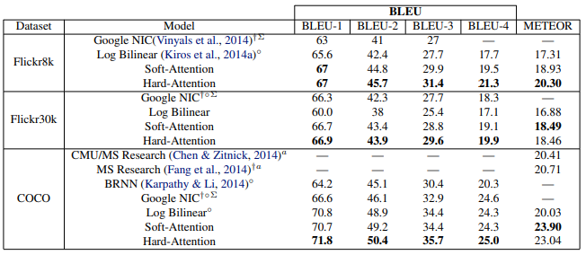
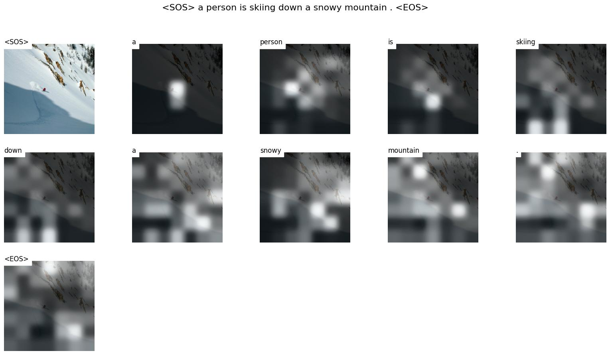

# Image Captioning Using Show, Attend and Tell

## Table of Contents

- [Introduction](#introduction)
- [Dataset and Vocabulary Construction](#dataset-and-vocabulary-construction)
- [Model Architecture](#model-architecture)
  - [Encoder (CNN)](#encoder-cnn)
  - [Decoder (RNN)](#decoder-rnn)
  - [Attention Mechanism](#attention-mechanism)
- [Training](#training)
- [Results](#results)
- [Usage](#usage)
- [Examples](#examples)
- [References](#references)


## Introduction

This project is an implementation of the paper "Show, Attend and Tell: Neural Image Caption Generation with Visual Attention" by Kelvin Xu, Jimmy Ba, Ryan Kiros, Kyunghyun Cho, Aaron Courville, Ruslan Salakhutdinov, Richard Zemel, Yoshua Bengio. The paper can be found [here](https://arxiv.org/abs/1502.03044).

It aims to generate captions for images using a Convolutional Neural Network (CNN) to extract features from the image and a Recurrent Neural Network (RNN) to generate the caption. The RNN uses an attention mechanism to focus on different parts of the image while generating the caption.

___


___


___


## Dataset and Vocabulary Construction

The Repository contains the necessary scripts to parse the following datasets:
- [Flickr8k](https://www.kaggle.com/adityajn105/flickr8k), which contains 8000 images with 5 captions for each image.
- [Flickr30k](https://www.kaggle.com/datasets/adityajn105/flickr30k?select=Images), which contains 31000 images with 5 captions for each image.

However, the dataset I used to train the model was the `Flickr8k` dataset. 

- I first constructed the vocabulary from the text of the dataset itself using the [`Spacy`](https://spacy.io/) library, which is a library for Natural Language Processing (NLP).
- I tokenized only the words that occurred at least 5 times in the dataset to reduce the size of the vocabulary (this has proven to generalize better and make the learning process easier, as the model will focus on the most common words).
    - I also added special tokens for padding (`<PAD>`), unknown words (`<UNK>`), start of sentence (`<SOS>`), and end of sentence (`<EOS>`).
    - the vocabulary also included the punctuation marks (`.`, `,`, `-`).
- then I added an embedding layer to the model to convert the words to vectors and let the model learn the embeddings during training.


*Image source: [What is Natural Language Processing (NLP) and How Can it Be Used in Healthcare?](https://medium.com/machine-learning-for-everyday-people/what-is-natural-language-processing-nlp-and-how-can-it-be-used-in-healthcare-2390f072d219)*


## Model Architecture

The model consist of 3 main parts:

### Encoder (CNN)


*Image source: [A PyTorch Tutorial to Image Captioning](https://github.com/sgrvinod/a-PyTorch-Tutorial-to-Image-Captioning)*

- the encoder is a Convolutional Neural Network (CNN) that takes the image and extracts the features from it (they represent what the neural network "sees" in the image).

- I used a pre-trained `ResNet-101` ,which was trained on the `ImageNet` dataset, as a starting point. the last layers of the network (which are responsible for making the final classification) were removed and an adaptive average pooling layer was added to make the output of the network a fixed size. (the output size was `14x14x2048`). where `2048` is the number of features extracted from the image.

### Decoder (RNN)


*Image source: [A PyTorch Tutorial to Image Captioning](https://github.com/sgrvinod/a-PyTorch-Tutorial-to-Image-Captioning)*

The decoder is a Recurrent Neural Network (RNN) that takes the caption word by word (more specifically, it takes the embeddings of the words as specified in the vocabulary section), and also takes the features extracted from the CNN encoder **but with different weights every time** -check the image above and notice that it pays attention to different parts of the encoded image as indicated by the white region- this is the attention mechanism that allows us to calculate the weights for each part of the image every timestep.

- Since we will feed the encoded image with different weights every time, we will manually do so using an lstm cell `nn.LSTMCell` in a loop for each word in the caption.


- the output of the decoder (lstm cell) is then passed through a linear layer to map it to the size of the vocabulary, and then applies a `softmax` function to get the probabilities of each word in the vocabulary being the next word that should be generated.

- These probabilities are then used (along with the actual next word in the caption) to calculate the loss using the `cross-entropy` loss function.

### Attention Mechanism


*Image source: [A PyTorch Tutorial to Image Captioning](https://github.com/sgrvinod/a-PyTorch-Tutorial-to-Image-Captioning)*

- The attention mechanism is what allows the decoder to focus on different parts of the image while generating the caption. it takes the encoded features from the CNN encoder and the hidden state of the RNN decoder (which represents the information the RNN has seen so far) and calculates the weights for each part of the image.
     - It takes the encoded features and maps them to an attention dimension using a linear layer.
    - Similarly, it maps the hidden state of the decoder to the same attention dimension using another linear layer.
    - These two projections are then added together and passed through a ReLU activation function.
    - The result is then passed through another linear layer to calculate the attention scores.
    - The attention scores are normalized using a softmax function to obtain the attention weights.
    - The context vector is calculated by taking the weighted sum of the encoded image features, where the weights are the attention scores.
    - This context vector is then used by the decoder to generate the next word in the caption.


## Training

The Training was done using these hyperparameters:
- `word embedding dimension = 512`
    - that is the size of the word embeddings that the model will learn during training.
- `attention dimension = 512`
    - that is the size of the attention dimension that the model will use to calculate the attention weights.
- `hidden dimension = 512`
    - that is the number of hidden units in the LSTM cell which corresponds to the output size.
- `batch size = 80`
- `dropout = 0.5`
    - that is the probability of dropping out a neuron in the model.
- `gradient clip = 5`
    - To prevent the gradients from exploding during training, I used gradient clipping to clip the gradients to a maximum value of 5.


The training was done on 2 Stages:

1. **Training the RNN Decoder Only**:
    - the CNN encoder was frozen and only the RNN decoder was trained.
    - the learning rate was set to `4e-4` on the `Adam` optimizer.
    - The model was trained for 120 epochs and using the `bleu-4` score as and early stopping metric (it reached the best score at epoch 9)

2. **Tuning the Whole Model**:
    - The whole model (decoder and encoder) was trained in this stage. Only the intermediate and advanced layers of the `ResNet-101` were tuned.
        - The decoder was trained with an initial learning rate of `4e-4` and the encoder was trained with an initial learning rate of `1e-4`.
        - both the encoder and the decoder were trained using the `Adam` optimizer and with a learning rate scheduler `CosineAnnealingWarmRestarts` with a period of 4 epochs (because that is when the model usually starts to converge) and a minimum learning rate of `1e-7`.
         

## Results

I used the `sacrebleu` library to calculate the `BLEU-4` score for the generated captions on the test set at different beam sizes for. The following results were obtained:

| Beam Size | Stage 1 | Stage 2 |
|-----------|---------|---------|
| 1         | 22.8    | 23.20   |
| 2         | 23.94   | 24.68   |
| 3         | 24.67   | 25.89   |


So, the best `BLEU-4` score on the `Flickr8k` dataset was `25.89` at beam size `3` after the second stage of training, which is higher than the score mentioned in the paper as per the image below, but that is probably due to the difference in the encoder used in the paper and the one used in this implementation.




## Usage

- The code contains a single notebook with all the code needed to preprocess the data, create the vocabulary, split the data, train the model, evaluate the results, and finally generate the captions for new images.

In addition, the code is also separated into different python scripts for better organization, modularity, and reusability.

1. `Preprocess.py`:
    - contains the code to construct the vocabulary and to split the data into training, validation, and test sets.

        ```bash
        python preprocess.py --dataset_name {flickr8k or flickr30k} --captions_path {path to the captions.txt} --frequency_threshold {frequency threshold for the vocabulary, if words appear less than this threshold, it will not be included in the vocabulary}
        ```
    - Example usage:
        ```bash
        python preprocess.py --dataset_name flickr8k --captions_path captions.txt --frequency_threshold 5
        ```
    - Outputs
        - `vocab.pkl`: the vocabulary file.
        - `train.csv`, `val.csv`, `test.csv`: the training, validation, and test sets respectively.

2. `Train.py`:
    - contains the code to train the model.

        ```bash
        python train.py --image_dir {path to the Images directory} --vocab_path {path to the vocabular pickle file ,created in preprocess.py} --train_csv {path to the train.csv file created in preprocess.py} --val_csv {path to the val.csv file created in preprocess.py} --test_csv /{path to the test.csv file created in preprocess.py}
        ```
    - Example usage:
        ```bash
        !python train.py --image_dir Images --vocab_path flickr8k_vocab.pkl --train_csv /flickr8k_train.csv --val_csv flickr8k_val.csv --test_csv flickr8k_test.csv
        ```
    - Outputs
        - `Checkpoint.pth.tar`: the model checkpoint with the best `BLEU-4` score on the validation set.
    - Note: There are a lot of hyperparameters that can be tuned inside the script itself. All of them have default values, but it might be worthwhile to experiment with them to see if the model can be improved. 
        - Model Parameters
            - `word_embedding_dim`: the size of the word embeddings.
            - `attention_dim`: the size of the attention dimension.
            - `hidden_size`: the number of hidden units in the LSTM cell.
            - `dropout`: the probability of dropping out a neuron.
            - `fine_tune_encoder`: whether to fine-tune the encoder or not.
        - Dataloader Parameters
            - `batch_size`: the batch size.
            - `num_workers`: the number of workers for the dataloader.
        - Training Parameters
            - `epochs`: the number of epochs to train the model.
            - `epochs_since_improvement`: the number of epochs since the last improvement in the `BLEU-4` score.
            - `encoder_lr`: the learning rate for the encoder.
            - `decoder_lr`: the learning rate for the decoder.
            - `grad_clip`: the maximum value for the gradient clipping.
        - Scheduler Parameters
            - `use_scheduler`: whether to use a learning rate scheduler or not (cosine annealing with warm restarts).
            - `T_0`: the period of the learning rate scheduler.
            - `T_mult`: the multiplier for the period of the learning rate scheduler.
            - `eta_min`: the minimum learning rate for the learning rate scheduler.
        - Loading model parameters
            - `Load_model`: whether to load a model checkpoint or not.
            - `checkpoint_path`: the path to the model checkpoint file.

3. `eval.py`
    - contains the code to evaluate the model on the given set (it performs beam search and without teacher forcing to evaluate the real performance of the model in test conditions -having no captions fed into the model-).

        ```bash
        python eval.py --vocab_path {path to the vocabulary pickle file created in preprocess.py} --checkpoint_path {path to the saved model checkpoint created in train.py} --imgs_path {path to the images directory} --df_path {path to the dataframe you want to evaluate, whether train.csv, val.csv, or test.csv} --beam_size {the beam size for the beam search algorithm, default is 3}
        ```
    - Example usage:
        ```bash
        python eval.py --vocab_path flickr8k_vocab.pkl --checkpoint_path checkpoint.pth.tar --imgs_path Images --df_path flickr8k_test.csv --beam_size 5
        ```
    - Outputs: It just prints the average `BLEU-4` on the given set.
    - note that if you made modifications to the model parameters, you should also make the same modifications in the `eval.py` script so that the model can be loaded correctly.

4. `caption.py`
    - contains the code to generate captions for new images. It takes the path to an image or a directory of images and generates captions for them as well as visualizing the attention weights.

        ```bash
        python caption.py --mode {the mode is either "image" or "directory"} --input_path {path to the image or directory of images} --vocab_path {path to the vocabulary pickle file, craeted in preprocess.py} --checkpoint_path {path to the model checkpoint, created in train.py} --output_dir {the path of the output directory where the images are to be saved} --beam_size {the beam size for the beam search algorithm}
        ```
    - example usage:
        ```bash
        python caption.py --mode directory --input_path test_images --vocab_path flickr8k_vocab.pkl --checkpoint_path checkpoint.pth.tar --output_dir test_images_output --beam_size 5
        ```

    - Outputs: It saves the image (or images) with the generated captions and the attention weights in the output directory.
    - note that if you made modifications to the model parameters, you should also make the same modifications in the `caption.py` script so that the model can be loaded correctly.

5. `utils.py`
    - contains utility functions that are used in the other scripts.
6. `dataset.py`
    - contains the dataset class that is used to load the images and captions.
7. `model.py`
    - contains the model classes (encoder, decoder, and the attention)


## Examples

Here are some examples of the generated captions on the test dataset:

___


___


___


___


___


___


___


___


___


___



___


## References

- [Show, Attend and Tell: Neural Image Caption Generation with Visual Attention](https://arxiv.org/abs/1502.03044)
- [A PyTorch Tutorial to Image Captioning](https://github.com/sgrvinod/a-PyTorch-Tutorial-to-Image-Captioning)
- [Deep Learning Specialization](https://www.deeplearning.ai/courses/deep-learning-specialization/)
- [Flickr8k](https://www.kaggle.com/adityajn105/flickr8k)
- [Flickr30k](https://www.kaggle.com/datasets/adityajn105/flickr30k?select=Images)
- [Spacy](https://spacy.io/)
- [sacrebleu](https://github.com/mjpost/sacrebleu)

