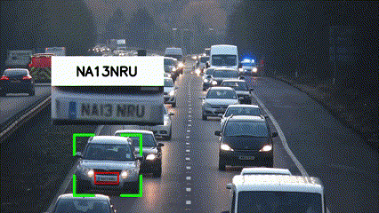
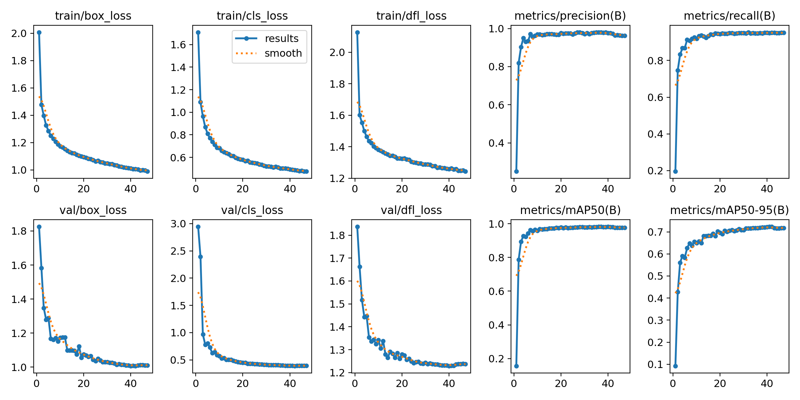
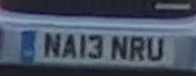
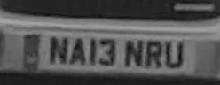
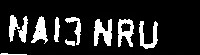
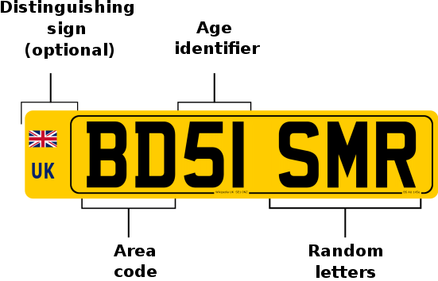

# Reading License Plates




## Table of Contents
- [Overview](#overview)
- [License Plate Detection](#license-plate-detection)
- [Cars Detection](#cars-detection)
- [Cars Tracking](#cars-tracking)
- [Reading Plate numbers (OCR)](#reading-plate-numbers-ocr)
- [References](#references)


## Overview
This projects detects License plates and reads the characters on them. To ennhance robustness of the OCR, the project utilizes the detection and tracking of cars as will. The workflow of the project is as follows:
1. **Detect License Plates**

In this step, The License plates are detectected using a tuned `YOLOv8` model (more on this in the [License Plate Detection](#license-plate-detection) section).

2. **Detect Cars**

To enhance the robustness of the OCR operations, the project detects cars in the image using a pre-trained `YOLOv8` model. This step is crucial as we assign the detected license plates to the detected cars for the next step. (more on this in the [Cars Detection](#cars-detection) section).

3. **Track Cars**

In this step, we track the detected cars using the `SORT` algorithm. Since each license plate is assigned to a car, when we track the cars, we are also tracking the license plates. This step enforces robustness against the variations of the OCR output (more on this in the [Reading Plate numbers (OCR)](#reading-plate-numbers-ocr) section).

4. **Read Plate Numbers**

In this step, we read the characters on the license plates using `Tesseract OCR` engine. The OCR engine is applied to the cropped license plates that are assigned to the tracked cars. Then, the text is preprocessed and checked for validity. Since each license has a specific format, the code is adjusted to only one format, which is the British license plate format. (more on this in the [Reading Plate numbers (OCR)](#reading-plate-numbers-ocr) section).


## License Plate Detection
- [Dataset](#dataset)
- [Training of the License plate detector](#training-of-the-license-plate-detector)

### Dataset

In order to detect License plates, a pre-trained YOLOv8n model is tuned on a license plate dataset. The dataset is a combination of the following datasets:
- [License Plate Recognition Image Dataset](https://universe.roboflow.com/roboflow-universe-projects/license-plate-recognition-rxg4e/dataset/4)
- [Egyptian Automatic License Plate Recognition (EALPR) dataset.](https://github.com/ahmedramadan96/EALPR)


### Training of the License plate detector
a general and diverse dataset is used with some emphasis on the Egyptian license plates. The model is trained using `Ultralytics` framework. The training default parameters are used except for following changes:
- batch size=64
- optimizer=AdamW
- patience = 5 (early stopping)

The mean average precision (mAP) of the model on the test set is as follows:
- mAP@50: 0.99
- mAP@50-95: 0.70

The rest of the metrics are as follows:




The weights are uploaded in the repository, but for thorough examination of the results, the model is available [on kaggle](https://www.kaggle.com/datasets/joe10mohamed/yolov8-licenseplates-adamw)


## Cars Detection
- [Cars Detection](#cars-detection)
- [Assosiating License Plates with Cars](#assosiating-license-plates-with-cars)

### Detection
This step is crucial for the robustness of the OCR operations. The cars are detected using a pre-trained YOLOv8 model from the `Ultralytics` framework, which is trained on the `COCO` dataset. 

### Assosiating License Plates with Cars
Now that we have the detected license plates and cars, each license plate is then assigned to one of the detected cars. This is done by a simple calculation which checks that the coordinates of the license plate are within the coordinates of one of the detected cars.


## Cars Tracking
The detected car-plates pairs are tracked using the `SORT` algorithm. This step is crucial and it is the core of the robustness mechanism of the OCR operations. If the OCR fails to read the characters on the license plate correctly for a certain frame or for couple of frames, the tracking algorithm will help in correcting the OCR output. As will be explained in the [Reading Plate numbers (OCR)](#reading-plate-numbers-ocr) section, the final reading of the plate is assigned as the most frequent output of the OCR for the tracked vehicle with the highest possible confidence.

## Reading Plate numbers (OCR)
- [reading plate numbers](#reading-plate-numbers)
- [text formatting](#text-formatting)
- [license plate confidence categorization](#license-plate-confidence-categorization)
- [Unification of the License Numbers](#unification-of-the-license-numbers)
- [visualizating the results](#visualizating-the-results)

### Reading Plate numbers

The characters on the license plates are read using the `Tesseract OCR` engine. The image is preprocessed before inputting it to the OCR engine. The preprocessing steps are as follows:
1. **Crop the license plate**
The license plate is cropped from the image using the coordinates of the bounding box of the detected license plate.




2. **Grayscale Conversion**
The cropped image is then converted to grayscale for later thresholding.



3. **Inverted Thresholding**

The image is then thresholded using the `cv2.THRESH_BINARY_INV` method. This method is used to convert the image to a binary image, where the pixels are either black or white. A threshold of 64 is used so that whatever is below 64 is converted to white and whatever is above 64 is converted to black.



It is then passed to the OCR engine to read the characters on the license plate.

### Text Formatting
This steps enhances the robustness of the OCR operations. The text is formatted in order to be standardized and comparable across the different Vehicle detections. The text is formatted as follows:

1. **Removing all non-alphanumeric characters**
In this step, all non-alphanumeric characters are removed from the text. This includes spaces, special characters, and punctuations.

2. **Converting all characters to uppercase**
so that it is robust against the case sensitivity of the OCR engine.

check `read_license_plate` function in the `utils.py` file for more details.

```python
def read_license_plate(license_plate_crop):
    text = pytesseract.image_to_string(license_plate_crop, lang='eng')
    # remove any non-alphanumeric characters
    text = ''.join(e for e in text if e.isalnum()).upper()
```

3. **OCR Correction**

This step is format-specific. So, the code is adjusted to the british license plate format. The aim of this step is to further correct the mistakes of the OCR by checking the validity of the output. 

The British license plate format is as follows:



The format is as follows:
- The first two characters are letters
- The next two characters are numbers
- The last three characters are letters

The code tries to correct the OCR output by checking whether the output text matches the format of the British license plate. If the text does not match the format, the code will try to correct the text by checking the following:

- if a digit in the text should be a character, the code checks whether this digit is similar to any of the characters in a way that confuses the OCR engine. For example, the digit `0` is similar to the letter `O`, so if the OCR reads the digit `0` as the letter `O`, the code will correct it.

here is the most common confusing mappings in the code
    
```python
dict_char_to_int = {'O': '0',
                    'I': '1',
                    'J': '3',
                    'A': '4',
                    'G': '6',
                    'S': '5',
                    'B': '8'}
```

- if a character in the text should be a digit, the code checks whether this character is similar to any of the digits in a way that confuses the OCR engine. It is the inverse of the above mapping.

```python
dict_int_to_char = {'0': 'O',
                    '1': 'I',
                    '3': 'J',
                    '4': 'A',
                    '6': 'G',
                    '5': 'S',
                    '8': 'B'}
```

the details of the code can be found in the `format_license` function in the `utils.py` file. 

Note that this function is country-specific with the aim to enhance the some of the OCR mistakes. The code can be adjusted to fit the license plate format of any country.

### License Plate Confidence Categorization
After making all possible corrections to the OCR output, the code categorizes them into 3 different categories

1. **High Confidence**
The text is categorized as high confidence if it matches the British license plate format, which means that could be a valid license plate number.

2. **Medium Confidence**
The text is categorized as medium confidence if it does not match the British license plate format, but at laest it is of the same length of the British license plate format. (which is 7 characters)

3. **Low Confidence**
The text is categorized as low confidence if it does not match the British license plate format and it is not of the same length of the British license plate format.


### Unification of the License Numbers
This is the step that benefits from the tracking of the cars. We have a csv files of all the tracked cars with their corresponding license plates. We also have different categorizations of the OCR output from the first step. This step works as follows:

- for each tracked unique vehicle in the video
    - if there are any readings with high confidence (meaning the text is a valid license plate number), get the most frequent license number that appeared in all frames and assign it to the vehicle.
    - if there are no readings with high confidence, get the most frequent license number that appeared in all frames with medium confidence and assign it to the vehicle.
    - for all vehicles that have no readings with high or medium confidence, discard them from the final output.

The details of this step are all in `postprocess.py` file. Note that there is a parameter that allows the user to decide whether to keep the vehicles with medium confidence or not. The default for them is to be discarded.

### Visualizating the Results
So far, the results are stored in a csv file with a log of all the tracked vehicles across different frames with their corresponding license plates. this step is for visualization purposes. There are 2 main components in here:

1. **interpolating the results**
To prevent intermittent visualizations for the frames in which the vehicle and it's license place are not detected, this steps interpolates the results of the tracked vehicles across different frames. 
- for each vehicle
    - the code checks the first and last frame in which the vehicle appeared
    - then, it linearly interpolates the license plate number of the vehicle across all the missing frames in between

The details of this step are all in `interpolate.py` file.

2. **Visualizing the results**

In this step, the code draws a bounding box around the detected license plate and the detected car. It also crops the license plate from the frame in which it is detected with the highest  confidence by the license plate detector. The code then writes the license plate number -all of them are now unified after the above step [Unification of the License Numbers](#unification-of-the-license-numbers)- on all the frames in which the vehicle appeared. 

The details of this step are all in `visualize.py` file.

## References
1. [Ultralytics Framework](https://github.com/ultralytics/ultralytics)
2. [SORT Algorithm](https://github.com/abewley/sort)
3. [Tesseract OCR](https://github.com/tesseract-ocr/tesseract)
4. [License Plate Recognition Image Dataset](https://universe.roboflow.com/roboflow-universe-projects/license-plate-recognition-rxg4e/dataset/4)
5. [Egyptian Automatic License Plate Recognition (EALPR) dataset.](https://github.com/ahmedramadan96/EALPR)
6. [automatic plate recognition](https://github.com/computervisioneng/automatic-number-plate-recognition-python-yolov8)