# Neural Style Transfer

## Table of Contents
1. [Introduction](#introduction)
2. [Problem Setup](#problem-setup)
3. [Architecture](#architecture)
4. [Loss Function](#loss-function)
5. [Results](#results)
6. [References](#references)

## Introduction

Neural Style Transfer is a technique that uses a neural network to generate an image that combines the content of one image with the style of another image. This implementation is based on the paper "A Neural Algorithm of Artistic Style" by Gatys et al. 

## Problem Setup

- we have two images
    - a content image: that contains the content we want to keep in the result
    - a style image: that contains the style we want to apply to the content image

In this Notebook, we will use the following content Image

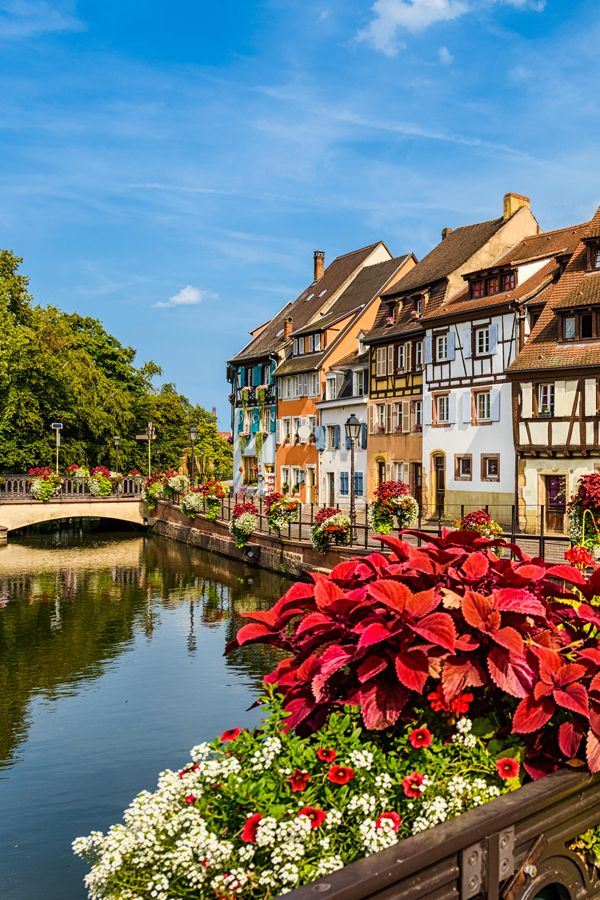

and the following style images

--------------------------------------------

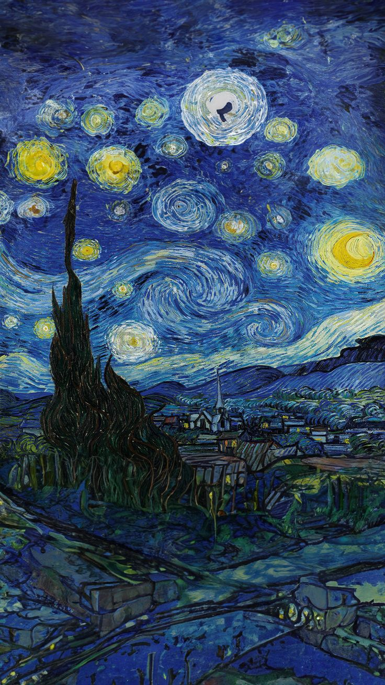
*Starry Night by Van Gogh*

--------------------------------------------

*seated nude by Picasso*

--------------------------------------------
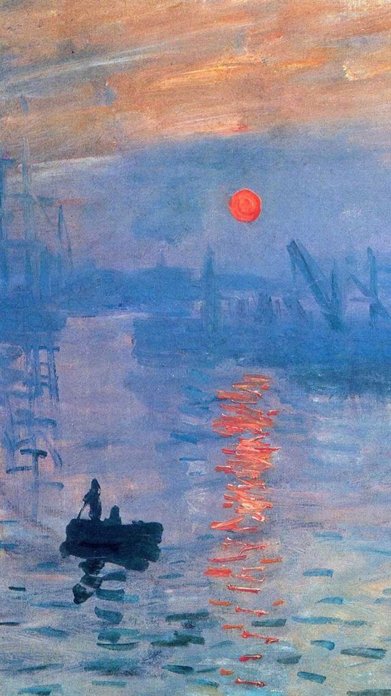
*Impression, Sunrise by Monet*

--------------------------------------------
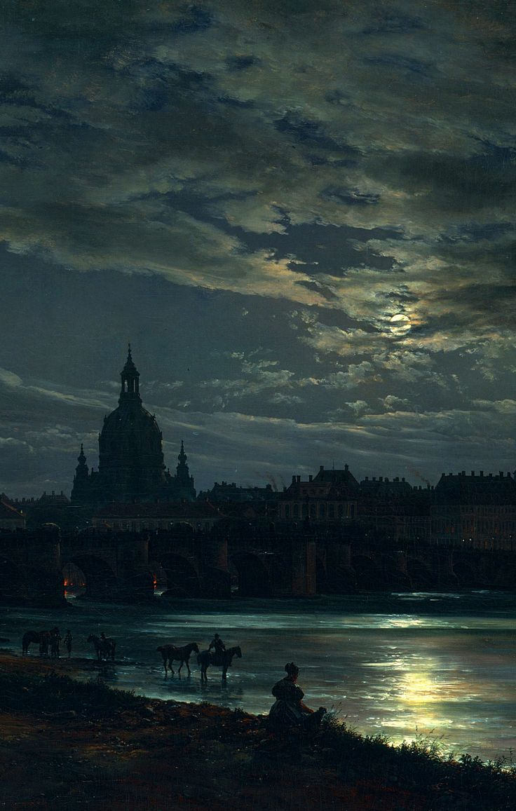
*Dresden by moonlight by Johan Christian Dahl*

--------------------------------------------

*Sailboat painting by DALL-E*

--------------------------------------------

*Glasgow, saturday night by John Atkinson Grimshaw*

--------------------------------------------

- What The paper does is that it starts with a random image (noise) as the generated image, and then it uses a pre-trained convolutional neural network to calculate the following
    1. the `content loss`: that is the difference between the content of the content image and content of the generated image
    2. the `style loss`: that is the difference between the style of the style image and the style of the generated image

- it will then combine these 2 losses with different weights (more on that in the loss function section) to get the total loss, and then it will use gradient descent to update the generated image directly to minimize this total loss (therefore making the generated image capture the content of the content image and the style of the style image)
    - but This notebook deviates from the paper in that it starts with the content image as the generated image (instead of starting with noise) but the rest is the same 

## Architecture

We can Use Any Pre-trained Convolutional Neural Network, but in this notebook, we will use the VGG19 model (pre-trained on ImageNet) as it is the one used in the paper.

The VGG19 Architecture is as follows

- we have 19 layers (16 convolutional layers split into 5 groups, and 3 fully connected layers)

## Loss Function

The Loss Function is a combination of the content loss and the style loss

1. The `content loss` is designed to capture the content of an image 
    - In CNNs, early layers capture low-level features (like edges and textures) while deeper layers capture high-level features (like objects and scenes)
    - So, normally what people do is that they choose an intermediate layer in the network, since it captures both low-level and high-level features to a certain extent
    - but what we will do is that we will use 5 different layers at different depths in the network to calculate the content loss
        - more precisely, we will use the first convolutional layer in each block as shown in red below

        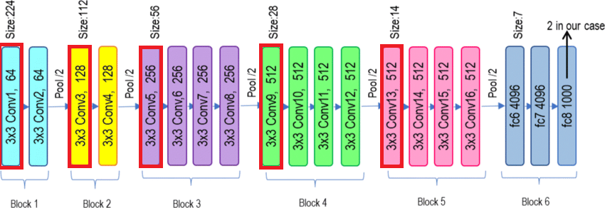

    - the equation for the content loss is the mean squared error 
        $$
        L_{content} = \frac{1}{m} \sum (F_{content}^{l} - F_{generated}^{l})^2
        $$

        where $F_{content}^{l}$ and $F_{generated}^{l}$ are the feature maps (activations) of the content image and the generated image of Layer $l$ respectively and $m$ is the number of elements in each feature map, this equation is slightly different from the paper as they divide by $2$ which we ignored because we will scale the content loss later on with a hyperparameter $\alpha$
    - so, we will subtract the activations of the content image from the activations of the generated image and square that difference -so that opposite values don't cancel each other out- and then take the mean of all these differences
        - and we will do this for 5 different layers and then sum them up to get the total content loss
        - minimizing this loss will make the generated image activations similar to the content image activations, therefore capturing the content of the content image

2. The `style loss` is designed to capture the style of an image
    - the style of an image is defined as the correlation between the activations of different layers
    - the 
    - So, for a layer $l$, it will have activations of shape $(c, h, w)$ where $c$ is the number of channels -or filters/feature maps-, and $h$ and $w$ are the height and width of the feature map 
        - and so, for the style image, if 2 features are correlated (for example, like in Van Gogh's paintings a feature might capture the wavy patterns in the sky and another feature might capture a blue color), and they might be correlated so that whenever the wavy pattern feature is activated, the blue color feature is also activated)
        - so, we will calculate this correlation for the style image (therefore capturing its style) and also for the generated image (to capture its style as well) then the loss will be the mean squared error between these 2 correlations
            - Therefore, minimizing this loss will (minimizing the difference between their correlations) will make the generated image capture the style of the style image

    - the equation for the style loss is 
        - first we calculate the Gram Matrix as follows 
            $$
            G = F^T F
            $$
            where $F$ is the reshaped feature map of shape $(c, h \times w)$
        - in other words, we will take the activations of a layer (reshaped to be of shape $(c, h \times w)$) and then multiply it by its transpose 
            - $(c, h \times w) \times (h \times w, c) = (c, c)$ and this is the Gram Matrix
        - then the style loss is the mean squared error between the Gram Matrix of the style image and the Gram Matrix of the generated image
            $$
            L_{style} = \frac{1}{c^2 (h \times w)^2} \sum (G_{style}^{l} - G_{generated}^{l})^2
            $$
        - we will do this for the same 5 chosen layers and then sum them up to get the total style loss
        - the above formula is slightly different from the paper, as they divide by $4 \times c^2 \times (h \times w)^2$ which we ignored because we will scale the style loss later on with a hyperparameter $\beta$

- The `total loss` is the sum of the content loss and the style loss with different weights determined by hyperparameters $\alpha$ and $\beta$
    $$
    L_{total} = \alpha L_{content} + \beta L_{style}
    $$
    - where $\alpha$ and $\beta$ are hyperparameters that determine how much we want to weight the content loss and the style loss respectively
    - Since we started with the content image as the generated image, we gave more emphasis to the style loss by setting $\alpha = 1$ and $\beta = 10$ but feel free to change these values to get different results
    

## Results

we ran the algorithm for 6000 iterations with learning rate $0.001$ and the following results were obtained

- Content Image with Style 1

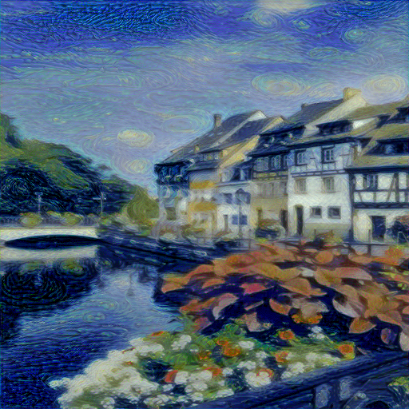

--------------------------------------------------------------
- Content Image with Style 2

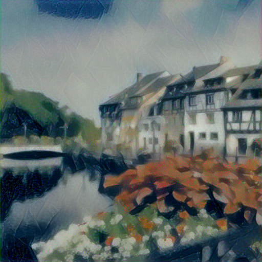

--------------------------------------------------------------
- Content Image with Style 3

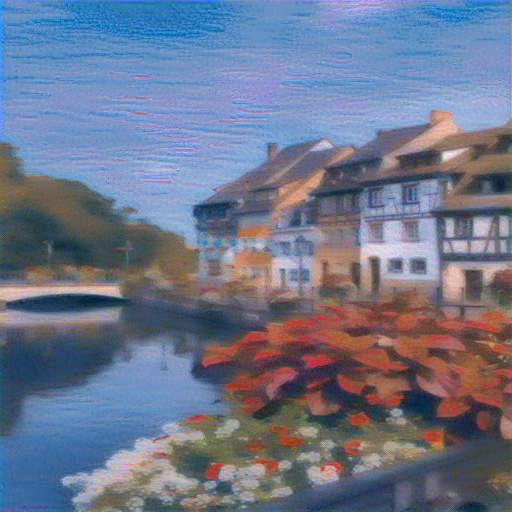

--------------------------------------------------------------
- Content Image with Style 4

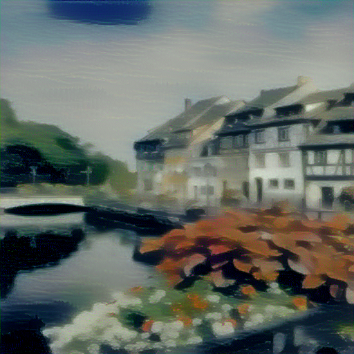

--------------------------------------------------------------
- Content Image with Style 5

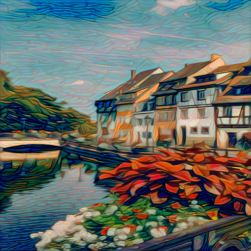

--------------------------------------------------------------
- Content Image with Style 6

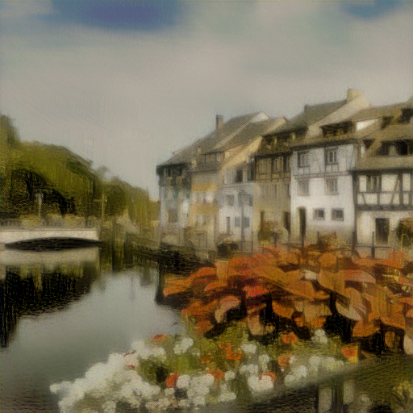

--------------------------------------------------------------
    

## References

- [A Neural Algorithm of Artistic Style](https://arxiv.org/abs/1508.06576)

- [VGG19](https://arxiv.org/abs/1409.1556)

- [PyTorch](https://pytorch.org/)