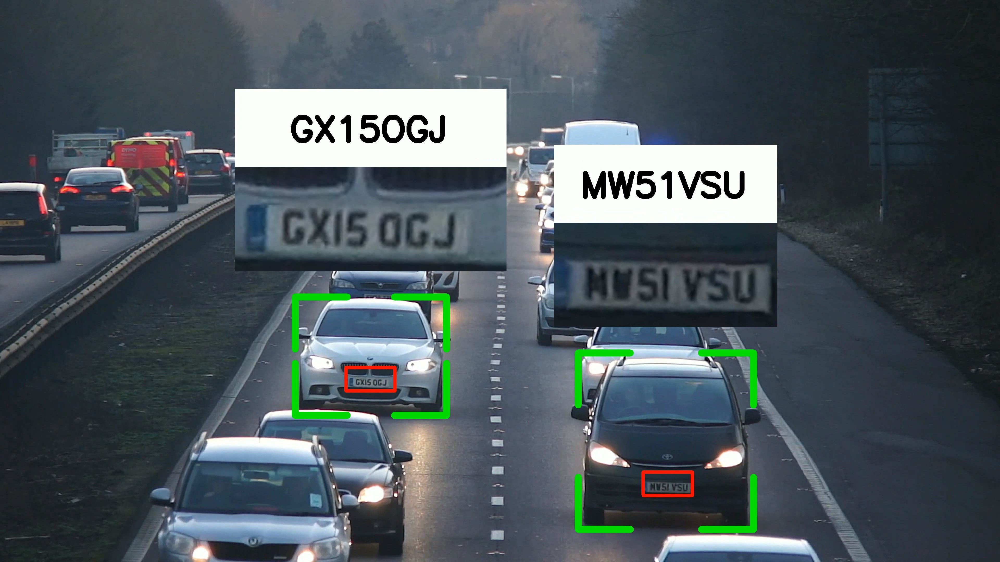
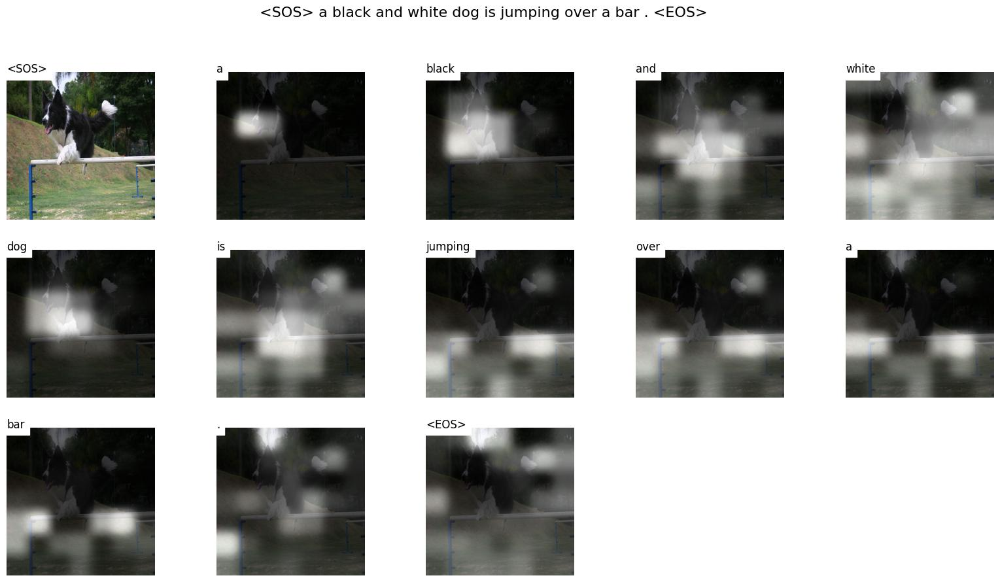

# Machine Learning and Deep Learning Projects

## [License Plates Reader](https://github.com/yousefelsharkawy/ML_DL_projects/tree/main/License_plate_reader)

- **Description**: This projects detects License plates and reads the characters on them. To ennhance robustness of the OCR, the project utilizes the detection and tracking of cars as will.

- **Technologies**: YOLOV8, OpenCV, Pytesseract, SORT

## [Image Captioning](https://github.com/yousefelsharkawy/ML_DL_projects/tree/main/Image_captioning)

*Generated Caption by the model: A black and white dog is Jumping Over a bar*

- **Description**: This project Implements the [Show, Attend and Tell: Neural Image Caption Generation with Visual Attention](https://arxiv.org/abs/1502.03044) paper. The Project first preprocess the Flickr8k/Flickr30k datasets and constructs a vocabulary. Then, it trains a CNN (ResNet101) and an LSTM with an attention mechanism to generate captions for images.

- **Technologies**: Pytorch (ResNet101, LSTM, Attention Mechanism), BLEU Score, Flickr8k/Flickr30k Datasets, Spacy (Tokenizer)

## [Semantic Segmentation with UNet](https://github.com/yousefelsharkawy/ML_DL_projects/tree/main/Semantic_Segmentation_UNet)

*segmentation of a car using the UNet ARchitecture in the Repo*

- **Description**: This Repo implements the UNet architecture from the paper [U-Net: Convolutional Networks for Biomedical Image Segmentation](https://arxiv.org/abs/1505.04597). The model is trained  on the [Carvana Image Masking Challenge](https://www.kaggle.com/c/carvana-image-masking-challenge) dataset. It Achieved a Dice Coefficient of 0.99188 on the test set.

- **Technologies**: Pytorch (UNet)

## [Neural Style Transfer](https://github.com/yousefelsharkawy/ML_DL_projects/tree/main/Neural_Style_Transfer)

- **Description**: This project implements the Neural Style Transfer algorithm from the paper [A Neural Algorithm of Artistic Style](https://arxiv.org/abs/1508.06576). The project uses a pretrained VGG19 model to extract features from the content and style images and then generates a new image that combines the content of the content image and the style of the style image.

- **Technologies**: Pytorch (VGG19)

