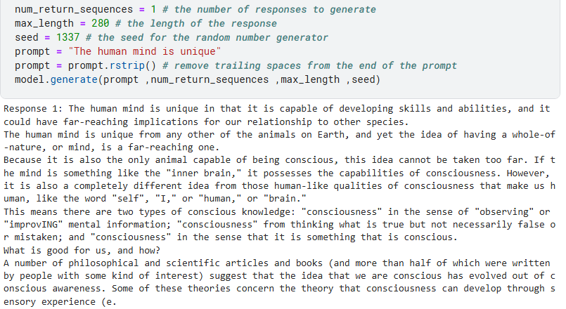
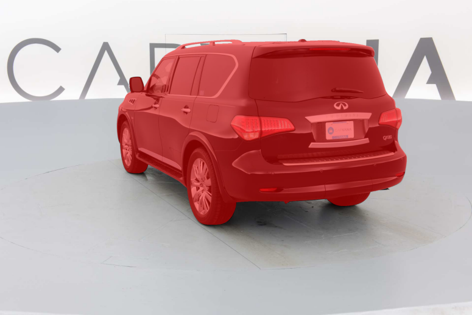
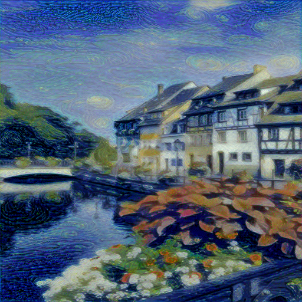

# Machine Learning and Deep Learning Projects

## [GPT2 From Scratch (124M Version)](https://github.com/yousefelsharkawy/ML_DL_projects/tree/main/GPT2_124M)

*generated text by the model for the prompt: "The human mind is unique"*

- **Description**: This Project is an implementation of the GPT2 model from scratch using PyTorch (the 124M version). It is based on OpenAI's ChatGPT-2 paper [Language Models are Unsupervised Multitask Learners](https://cdn.openai.com/better-language-models/language_models_are_unsupervised_multitask_learners.pdf), ChatGPT-3 paper [Language Models are Few-Shot Learners](https://arxiv.org/pdf/2005.14165.pdf), and Andrej Karpathy's wonderful series [Neural Networks Zero to Hero](https://www.youtube.com/playlist?list=PLAqhIrjkxbuWI23v9cThsA9GvCAUhRvKZ). 

    The model is trained on 10 Billion tokens of [FineWeb EDU](https://huggingface.co/datasets/HuggingFaceFW/fineweb-edu) dataset and the code is optimized for both Ampere GPUs and older GPUs using techniques like TensorFloat32, Torch Compile, Flash Attention, Automatic Mixed Precision, Fused AdamW, and Distributed Data Parallel on multiple GPUs. The repo also implements the Byte Pair Encoding tokenizer (which is the tokenizer used in OpenAI's GPT models) in case you want to construct your own vocabulary. 

    The resulting model exceeds the performance of the corresponding original GPT2 model published by OpenAI on The HellaSwag dataset with a score of 30.67% compared to 29.55% for the original GPT2 model.

    

    The code can be easily adjusted to train larger versions of GPT2 or even GPT3 models if you have the patience and resources to do so.

- **Technologies**: PyTorch (GPT2 Transformer, Automatic mixed precision, Fused AdamW, Flash Attention, Torch Compile, TensorFloat32, Distributed Data Parallel), Tiktoken (OpenAI's tokenizer), HuggingFace (FineWeb EDU Dataset), HellaSwag Dataset (for evaluation)

## [License Plates Reader](https://github.com/yousefelsharkawy/ML_DL_projects/tree/main/License_plate_reader)

- **Description**: This projects detects License plates and reads the characters on them. To ennhance robustness of the OCR, the project utilizes the detection and tracking of cars as will.

- **Technologies**: YOLOV8, OpenCV, Pytesseract, SORT

## [Image Captioning](https://github.com/yousefelsharkawy/ML_DL_projects/tree/main/Image_captioning)

*Generated Caption by the model: A black and white dog is Jumping Over a bar*

- **Description**: This project Implements the [Show, Attend and Tell: Neural Image Caption Generation with Visual Attention](https://arxiv.org/abs/1502.03044) paper. The Project first preprocess the Flickr8k/Flickr30k datasets and constructs a vocabulary. Then, it trains a CNN (ResNet101) and an LSTM with an attention mechanism to generate captions for images.

- **Technologies**: Pytorch (ResNet101, LSTM, Attention Mechanism), BLEU Score, Flickr8k/Flickr30k Datasets, Spacy (Tokenizer)

## [Semantic Segmentation with UNet](https://github.com/yousefelsharkawy/ML_DL_projects/tree/main/Semantic_Segmentation_UNet)

*segmentation of a car using the UNet ARchitecture in the Repo*

- **Description**: This Repo implements the UNet architecture from the paper [U-Net: Convolutional Networks for Biomedical Image Segmentation](https://arxiv.org/abs/1505.04597). The model is trained  on the [Carvana Image Masking Challenge](https://www.kaggle.com/c/carvana-image-masking-challenge) dataset. It Achieved a Dice Coefficient of 0.99188 on the test set.

- **Technologies**: Pytorch (UNet)

## [Neural Style Transfer](https://github.com/yousefelsharkawy/ML_DL_projects/tree/main/Neural_Style_Transfer)

*Generated Image by the model*

- **Description**: This project implements the Neural Style Transfer algorithm from the paper [A Neural Algorithm of Artistic Style](https://arxiv.org/abs/1508.06576). The project uses a pretrained VGG19 model to extract features from the content and style images and then generates a new image that combines the content of the content image and the style of the style image.

- **Technologies**: Pytorch (VGG19)

