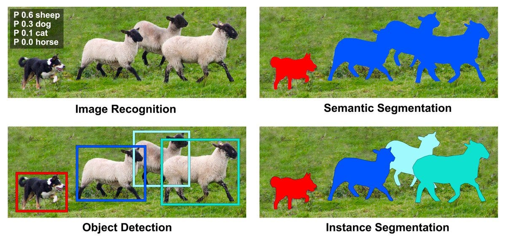
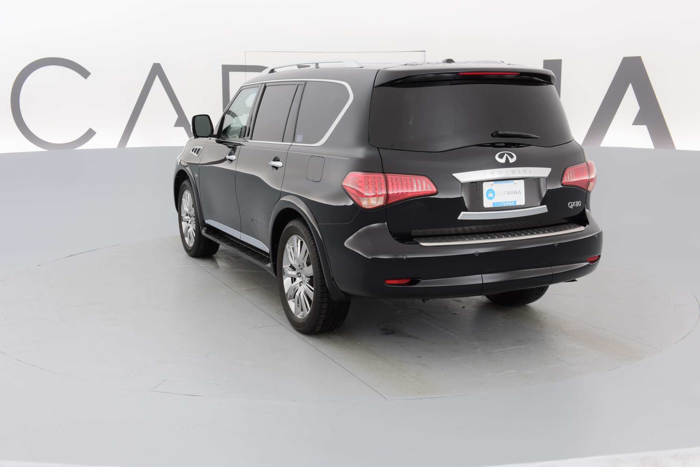
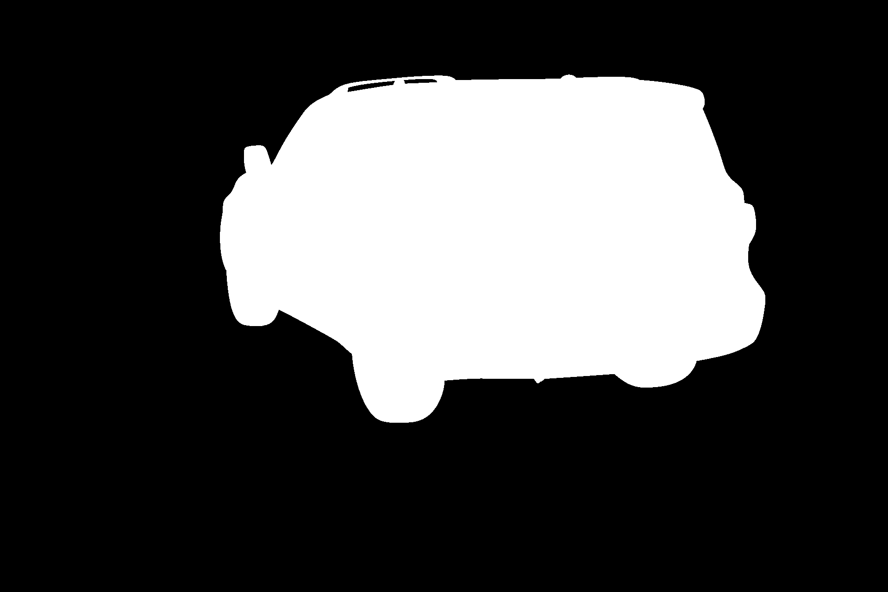
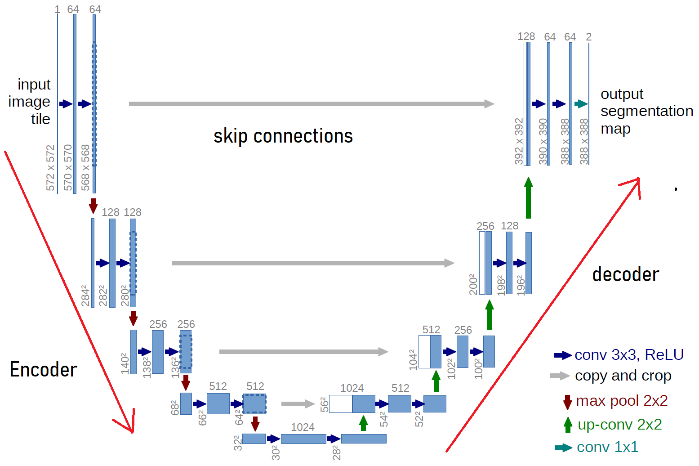

# Semantic Segmentation with UNet

## Table of Contents
1. [Introduction](#introduction)
2. [Dataset](#dataset)
3. [Architecture](#architecture)
4. [Training process](#training-process)
5. [Results](#results)
6. [References](#references)

## Introduction

This project is an implementation of the UNet architecture for semantic segmentation. The UNet architecture was first introduced in the paper [U-Net: Convolutional Networks for Biomedical Image Segmentation](https://arxiv.org/abs/1505.04597) by Ronneberger et al. The architecture is designed for biomedical image segmentation, but it can be applied to other segmentation tasks as well. 

- in `semantic segmentation`, the goal is to classify each pixel in an image as belonging to a particular class. An example on that is shown below:

*in semantic segmentation -top right-, each pixel is classified as belonging to a particular class and we don't differentiate between instances of the same class unlike instance segmentation -bottom right- where each instance of the same class is differentiated.* 

## Dataset

The dataset used for this project is the [Carvana Image Masking Challenge](https://www.kaggle.com/c/carvana-image-masking-challenge) dataset. The dataset consists of different images of cars and their corresponding segmentation masks. Example from the dataset is shown below:

- the image of the car:

- the segmentation mask of the car:

## Architecture

- The Unet Architecture is shown below:

- The U-Net architecture is symmetric, and it consists of two parts:
    - Contracting path (Encoder)
        - The contracting path is a typical convolutional network that consists of repeated application of convolutions, downsampling, and ReLU activations.
    - Expansive path (Decoder)
        - The expansive path consists of upsampling (also called transposed convolution), concatenation with the corresponding cropped feature map from the contracting path, followed by convolution, and ReLU activation.
    - Skip connections
        - The skip connections are the concatenation of feature maps from contracting path with the corresponding feature maps in the expansive path.

- The intuition behind this Architecture is that, as we go deeper into the encoder, which is a typical convolutional neural network, we learn more abstract features that are useful to understand the context of the image. However, we also lose spatial information about the image. Since the output is a mask of the same size as the input image -to classify each pixel in the image-, we need to recover the spatial information. So, the decoder part of the network uses something called `transposed convolution` to upsample the feature maps up to the original image size. There are also skip connections between each level of the encoder and the corresponding level in the decoder. These skip connections concatenate the feature maps from the encoder with the upsampled feature maps in the decoder. This helps the network recover the spatial information lost in the encoder and also helps the network learn to make more precise segmentation masks.

- Architecture Details:

1. `Encoder`:
    - The encoder part consists of multiple levels of convolutional blocks (4 levels to get to the bottleneck layer -bottom of the Unet-).
    - in each level, The paper applies two convlutional layers followed by a pooling layer.
        - but we will also add batch normalization layers after each convolutional layer for better training stability and faster convergence.
        - so the pattern is Conv2D -> BatchNorm -> Conv2D -> BatchNorm -> MaxPooling2D.
    - The convolutional layers have a kernel size of 3x3, stride=1, and 'ReLU' activation function.
        - but we will also use padding=1 `same padding` to keep the spatial dimensions of the feature maps the same. This deviation from the original paper will make the dimensions match up when we add the skip connections between each level of the encoder and the corresponding level in the decoder.
    - the number of filters in the first level is 64, and it doubles in each subsequent level.
    - so if we have an input image of size WxHxC, the output of the encoder will have dimensions W/16 x H/16 x 1024 that represents what the network learned about the image.

2. `Decoder`:
    - The decoder part consists of multiple levels of convolutional blocks (4 levels to get to the output layer -top of the Unet-).
    - in each level, The paper applies two convlutional layers followed by an upsampling layer.
        - but we will also add batch normalization layers after each convolutional layer in the decodeer as well
        - so the pattern is Conv2D -> BatchNorm -> Conv2D -> BatchNorm -> UpSampling2D.
    - The convolutional layers also have a kernel size of 3x3, stride=1, and 'ReLU' activation function. and padding=1 `same padding`.
    - the number of filters in the first level is 512, and it halves in each subsequent level. (basically the reverse of the encoder).
    - `ConvTranspose2D` is used for upsampling, which is also called `transposed convolution` or `deconvolution`. Although it is called deconvolution, it is not the true inverse of convolution. 
        - check these visualizations to understand how `ConvTranspose2D` works:
            - [Transposed Convolution](https://github.com/vdumoulin/conv_arithmetic/blob/master/README.md)
    - So, we will go from W/16 x H/16 x 1024 to W x H x 64 -at the top of the Unet-. Then we apply a 1x1 convolutional layer, which is used to change the number of filters from 64 to the number of classes we want to segment the image into. In our case, we have only one class, which is the car, so we will go from 64 filters to 1 filter. The output of this layer will be the segmentation mask of the input image.

3. `Skip Connections`:
    - As mentioned earlier, the skip connections are the concatenation of feature maps from the encoder with the corresponding feature maps in the decoder. They help the network recover the spatial information lost in the encoder and also help the network learn to make more precise segmentation masks.
    - In the encoder part, we start with WxHx64,
        - if we go down to the next level, we will have W/2 x H/2 x 128, then W/4 x H/4 x 256, W/8 x H/8 x 512, and finally W/16 x H/16 x 1024 -bottom of the Unet and the end of the encoder-.
    - then in the decoder
        - if we go up to the next level, we will have W/8 x H/8 x 512 -which matches the size of the corresponding level in the encoder, allowing us to concatenate the feature map directly -since the area of the feature map is the same-.

    - Notice that an input size is advised to be divisible by 16 so that the dimensions match up when we add the skip connections between each level of the encoder and the corresponding level in the decoder. However, if an inapropriate size is used, the code handles that by interpolating the shape before adding the skip connection.

         
## Training process

- The training process is as follows:
    - Some transformations are applied to the input image and the segmentation mask:
        - Resize to 480x320x3
        - Rotate by a random angle
        - Random horizontal flip with a probability of 0.5
        - Random vertical flip with a probability of 0.1
        - Normalize the image
    - During test time, we only resize and normalize

- The following hyperparameters were used
    - Batch size: 16
    - Learning rate: 0.0001
    - Number of epochs: 20
    - Loss function: Binary Cross Entropy
    - Optimizer: Adam
    - used Cosine Annealing Warm Restarts for the learning rate scheduler
    - used Automatic mixed precision with gradient scaling for faster training

## Results

The model Achieved a Dice Coefficient of 0.99188 on the test set.

## References

- [U-Net: Convolutional Networks for Biomedical Image Segmentation](https://arxiv.org/abs/1505.04597)
- [Carvana Image Masking Challenge](https://www.kaggle.com/c/carvana-image-masking-challenge)
- [Transposed Convolution](https://github.com/vdumoulin/conv_arithmetic/blob/master/README.md)
- [Pytorch Tutorials](https://www.youtube.com/playlist?list=PLhhyoLH6IjfxeoooqP9rhU3HJIAVAJ3Vz)
- [PyTorch Documentation](https://pytorch.org/docs/stable/index.html)

